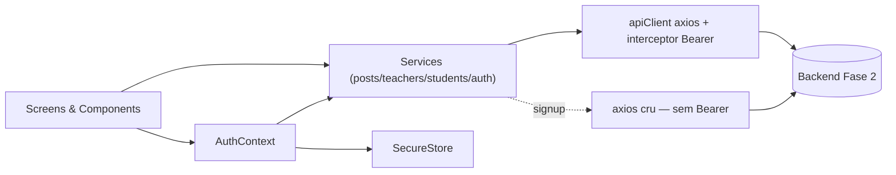
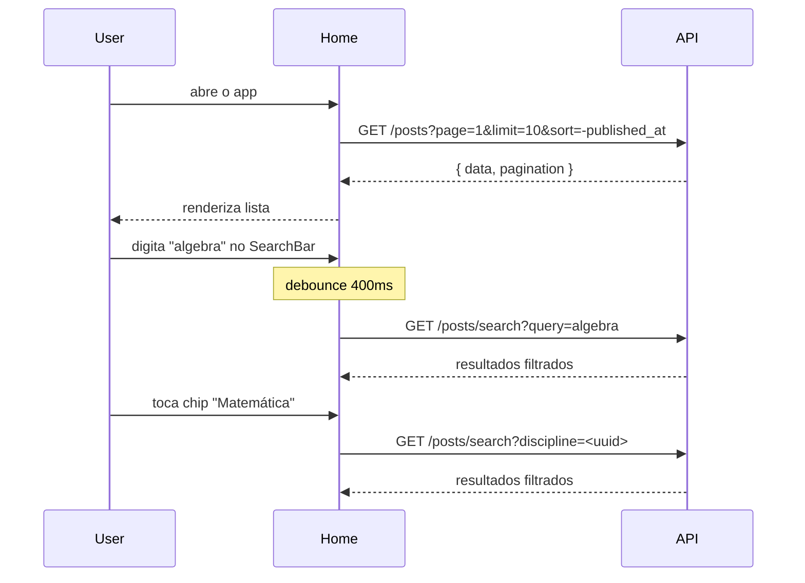
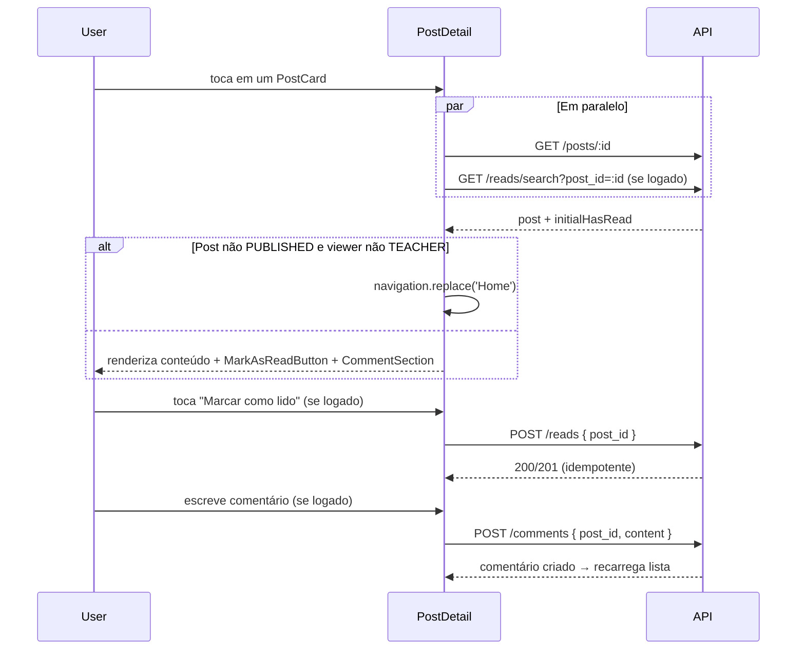
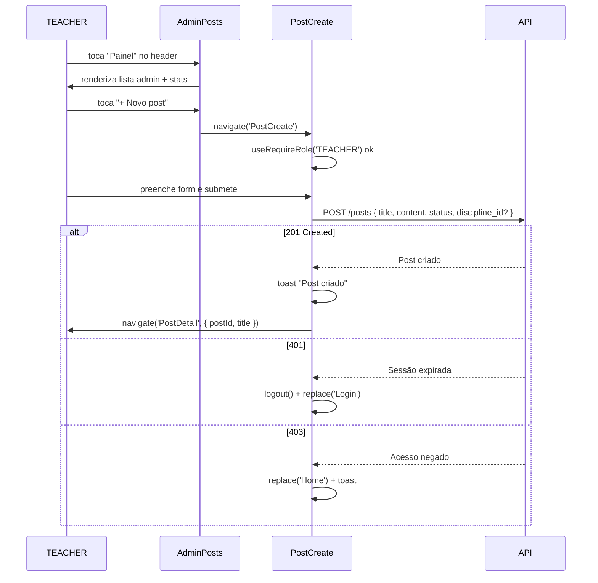
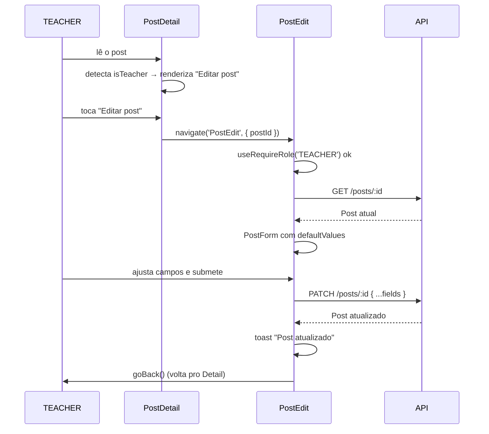
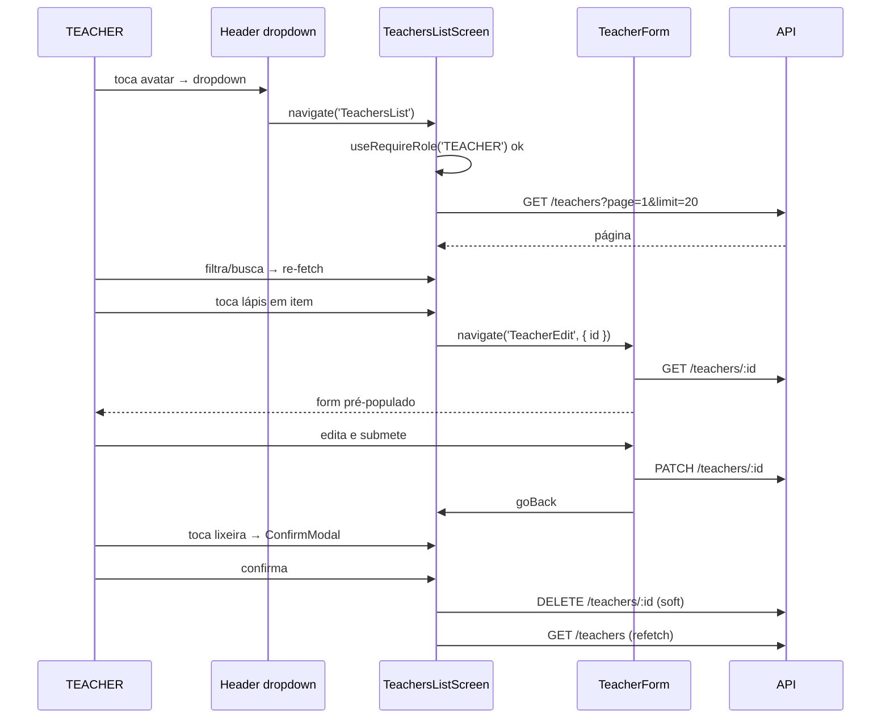
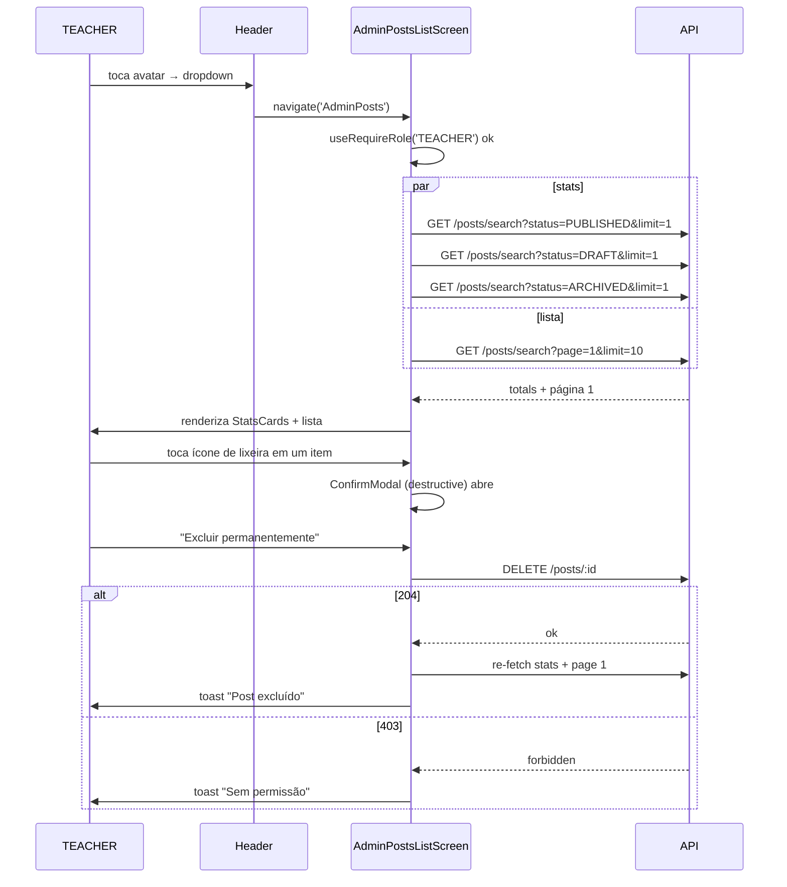
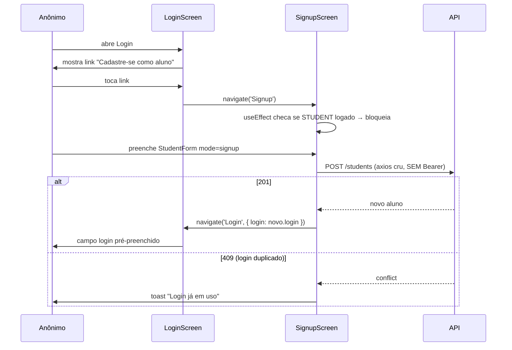

# Tech Challenge Fase 4 — Frontend Mobile (React Native)

<div align="center">

**App mobile da plataforma de blogging educacional — leitura para todos, gestão para docentes.**

[](https://expo.dev/)
[](https://reactnative.dev/)
[](https://www.typescriptlang.org/)
[](https://www.nativewind.dev/)
[](https://jestjs.io/)
[](https://opensource.org/licenses/MIT)

</div>

> **Status:** ✅ Entrega completa — **10/10 requisitos do enunciado** atendidos + extras (auto-cadastro de aluno, meu perfil, troca de senha).

---

## 📋 Índice

1. [Sobre o Projeto](#-sobre-o-projeto)
2. [Requisitos Atendidos](#-requisitos-atendidos)
3. [Stack](#️-stack)
4. [Hooks e Componentes Funcionais](#-hooks-e-componentes-funcionais)
5. [Arquitetura](#️-arquitetura)
6. [Autenticação](#-autenticação)
7. [Fluxos por Requisito](#-fluxos-por-requisito)
8. [Endpoints Consumidos](#-endpoints-consumidos)
9. [Design System](#-design-system)
10. [Testes](#-testes)
11. [Decisões Arquiteturais (ADRs)](#-decisões-arquiteturais-adrs)
12. [Dificuldades Encontradas](#️-dificuldades-encontradas)
13. [Setup e Instalação](#-setup-e-instalação)
14. [Acessibilidade](#-acessibilidade)
15. [Equipe](#-equipe)
16. [Licença](#-licença)

---

## 🎯 Sobre o Projeto

Frontend mobile (React Native + Expo) do sistema de blogging educacional do Tech Challenge da FIAP 8FSDT. Consome a API REST construída na Fase 2 e espelha os fluxos do frontend web da Fase 3, com dois papéis distintos: **TEACHER** (acesso total) e **STUDENT** (leitura + perfil próprio).

### Contexto

Professores da rede pública de educação carecem de plataformas onde possam publicar aulas e compartilhar conhecimento de forma prática, centralizada e tecnológica. A **Fase 2** entregou a API backend (Node.js + PostgreSQL); a **Fase 3** entregou o frontend web (Next.js). A **Fase 4** leva essa experiência para o **celular** — o meio onde alunos e professores da rede pública mais estão — com um app nativo, acessível e offline-tolerante para o cold start do backend.

### Solução

App React Native (Expo, managed workflow) que consome a mesma API REST da Fase 2 e reaproveita as regras de negócio e o Design System da Fase 3. A entrada é **pública** (qualquer pessoa lê os posts publicados, busca e filtra por disciplina); o **login** é opcional e existe para desbloquear comentários, marcação de leitura e — para docentes — o painel administrativo e o CRUD de usuários.

### Funcionalidades entregues

- **Leitura pública de posts** — lista paginada, busca por palavra-chave (debounce), filtro por disciplina, detalhe do post, comentários (criar/excluir conforme RBAC) e marcação de "lido".
- **Auto-cadastro de aluno** — fluxo público de signup (`POST /students` sem Bearer).
- **Login + meu perfil + trocar senha** — autenticação por `login`/senha, tela de perfil próprio (ver/editar) e troca de senha com validação cruzada.
- **TEACHER** — criar/editar/excluir posts, painel administrativo de posts (com estatísticas), CRUD completo de professores e CRUD de alunos.

### Capturas de tela

| Home | Header dropdown | Painel admin |
|------|------------------|--------------|
|  |  |  |

| Meu perfil | Trocar senha | Post (detalhe) | Post (comentários) |
|------------|--------------|-----------------|---------------------|
|  |  |  |  |

## Índice

| Home (lista pública) | Detalhe do post | Painel admin |
|:---:|:---:|:---:|
|  |  |  |

| Meu perfil | Trocar senha | Menu lateral (Drawer) |
|:---:|:---:|:---:|
|  |  |  |

---

## ✅ Requisitos Atendidos

Rastreabilidade direta entre os requisitos do enunciado e a tela/rota que os implementa. Os fluxos de cada um estão detalhados em [Fluxos por Requisito](#-fluxos-por-requisito).

| # | Requisito (enunciado) | Onde foi atendido | Status |
|---|-----------------------|-------------------|:------:|
| 1 | Página principal — lista de posts + busca por palavra-chave | `HomeScreen` + `SearchBar` + `DisciplineChips` | ✅ |
| 2 | Leitura de post (comentários opcionais) | `PostDetailScreen` + `CommentSection` | ✅ |
| 3 | Criação de postagens (professor) | `PostCreateScreen` | ✅ |
| 4 | Edição de postagens (professor) | `PostEditScreen` | ✅ |
| 5 | Criação de professores | `TeacherCreateScreen` | ✅ |
| 6 | Edição de professores | `TeacherEditScreen` | ✅ |
| 7 | Listagem paginada de professores (editar/excluir) | `TeachersListScreen` | ✅ |
| 8 | Replicar 5–7 para estudantes | `StudentsListScreen` · `StudentCreateScreen` · `StudentEditScreen` | ✅ |
| 9 | Página administrativa — listar todos os posts (editar/excluir) | `AdminPostsListScreen` | ✅ |
| 10 | Autenticação e autorização (login + gate por papel) | `LoginScreen` + `AuthContext` + `useRequireRole` | ✅ |

**Extras entregues além do enunciado:** auto-cadastro público de aluno (`SignupScreen`), meu perfil ver/editar (`ProfileScreen` / `ProfileEditScreen`), troca de senha (`ChangePasswordScreen`), marcação de leitura (`MarkAsReadButton`) e comentários (`CommentSection`).

---

## 🛠️ Stack

| Camada | Tecnologia | Propósito no projeto |
|--------|-----------|----------------------|
| Runtime | Expo SDK 56 (managed) | Build/dev sem toolchain nativo, distribuição via Expo Go / EAS |
| Linguagem | TypeScript (strict) | Inferência de tipos end-to-end entre schemas Zod, tipos da API e telas |
| Estilização | NativeWind v4 (Tailwind v3) | Utility-first com continuidade visual direta da Fase 3 web |
| Formulários | react-hook-form + Zod v4 | Validação tipada, re-renders mínimos, inferência automática Zod → TS |
| HTTP | Axios | Cliente único + interceptor que injeta `Authorization: Bearer` e trata 401 global |
| Estado global | Context API (`AuthContext`) | Único domínio global (sessão) — não justifica boilerplate de Redux |
| Navegação | React Navigation v7 (Drawer + Native Stack) | Drawer como navegação/descoberta; Stack empilha as telas; guard por papel |
| Armazenamento seguro | expo-secure-store | JWT + credencial + perfil criptografados no Keychain/Keystore |
| Markdown | `@ronradtke/react-native-markdown-display` | Render do conteúdo Markdown dos posts (fork mantido para RN 0.85 / React 19) |
| Testes | Jest + @testing-library/react-native | Preset `jest-expo`; 355 testes em 63 suites |

---

## 🪝 Hooks e Componentes Funcionais

A aplicação é **100% componentes funcionais com hooks** — não há class components (requisito técnico nº 1 do enunciado). Hooks do React efetivamente usados no código-fonte:

| Hook | Onde (exemplos) | Para quê |
|------|-----------------|----------|
| `useState` | telas, formulários, contexto (26 arquivos) | estado local de UI e dados |
| `useEffect` | `AuthContext` (hydration), telas (fetch), `useRequireRole` (auto-gate) (22 arquivos) | side effects |
| `useCallback` | listas com re-fetch, paginação (7 arquivos) | memoização de handlers |
| `useContext` | `useAuth` | acesso ao `AuthContext` |
| `useRef` | pickers/detecção de foco (4 arquivos) | referências mutáveis sem re-render |
| `useMemo` | composição de query derivada | memoização de valor computado |

Hooks de bibliotecas:

| Hook / API | Origem | Onde |
|------------|--------|------|
| `useForm` + `Controller` | react-hook-form | todos os formulários (login, post, teacher, student, senha) |
| `zodResolver` | `@hookform/resolvers/zod` | integra Zod com o RHF nos mesmos formulários |
| `useNavigation` / `useRoute` | React Navigation | navegação programática e leitura de params (18 / 6 arquivos) |
| `useFocusEffect` | React Navigation | re-fetch da `ProfileScreen` ao ganhar foco (ADR 24) |

**Custom hooks:**
- `useAuth()` — encapsula `useContext(AuthContext)` com tratamento de erro; usado em todo componente que precisa da sessão.
- `useRequireRole(role)` — auto-gate de papel por tela (redireciona para `Home` + Toast se o papel não bate); centraliza o controle de acesso (ADR 10).

---

## 🏗️ Arquitetura

### Estrutura de pastas

```
src/
├── api/            # apiClient (Axios) + interceptors (Bearer, handler 401 global)
├── components/
│   ├── ui/         # Design System (Button, Input, Card, Badge, ConfirmModal, ...)
│   ├── layout/     # Header (dropdown autenticado por papel)
│   ├── posts/      # PostCard, SearchBar, DisciplineChips, MarkAsReadButton, ...
│   └── admin/      # AdminPostListItem
├── contexts/       # AuthContext + hook useAuth
├── features/       # Módulos por domínio: auth, comments, grupo, posts, profile,
│                   #   students, teachers (screens/components/validators Zod)
├── hooks/          # useRequireRole (auto-gate por papel)
├── lib/            # disciplines.ts (mapa + fallback), markdown.ts (render)
├── navigation/     # RootStackNavigator + Drawer + AppDrawerContent + guards
├── screens/        # Telas de topo: Home, PostDetail, Admin, CRUD teachers/students,
│                   #   Profile, ProfileEdit, ChangePassword, Signup
├── services/       # Acesso à API: auth, posts, comments, reads, disciplines,
│                   #   teachers, students, secure-storage
├── theme/          # colors.ts (tokens M3) + elevation.ts
└── types/          # Interfaces TypeScript da API (Post, Teacher, Student, ...)
```

> Os schemas Zod não ficam em `lib/schemas`, e sim colocados junto do domínio em `features/<domínio>/validators/` (ex.: `features/auth/validators/login.schema.ts`).

### Topologia de navegação

A navegação é um **Drawer (menu lateral) envolvendo um Native Stack**. O `RootDrawer.Navigator` tem uma única `Screen` (`Root`) cujo componente é o `RootStackNavigator` (`createNativeStackNavigator`). Ou seja: o Drawer é a camada de **navegação e descoberta**, e o Native Stack é quem empilha as telas. O conteúdo do menu lateral é renderizado por um `drawerContent` customizado ([src/navigation/AppDrawerContent.tsx](src/navigation/AppDrawerContent.tsx)), não pela lista automática de rotas.

O app abre **direto na lista de posts pública** (rota `Home`). Não há "login wall" — qualquer pessoa (anônimo, STUDENT ou TEACHER) pode abrir o app, abrir o menu lateral e navegar pelo conteúdo público. Login é uma rota acessada via botão "Entrar" no header; existe principalmente para desbloquear o painel administrativo (TEACHER).

```
RootDrawer (Drawer)  ──drawerContent──▶  AppDrawerContent (menu lateral)
│
└── "Root"  =  RootStackNavigator (Native Stack, initialRouteName="Home")
    │
    ├── Home             (pública — entry point; aceita disciplineId p/ filtrar a lista)
    ├── Login            (pública — acessada via "Entrar")
    ├── Signup           (pública — auto-cadastro de aluno; bloqueia STUDENT já logado)
    ├── PostDetail       (pública — redireciona Home se DRAFT/ARCHIVED e não-TEACHER)
    ├── Grupo            (pública — página fixa do grupo 6)
    ├── Profile          (autenticado — ProfileScreen read-only)
    ├── ProfileEdit      (autenticado — TeacherForm ou StudentForm em modo edit)
    ├── ChangePassword   (autenticado — form com Zod cross-field)
    ├── AdminPosts       (TEACHER-only — lista admin com stats + delete)
    ├── PostCreate       (TEACHER-only)
    ├── PostEdit         (TEACHER-only)
    ├── TeachersList     (TEACHER-only — lista paginada + filtros + soft delete + reativar)
    ├── TeacherCreate    (TEACHER-only)
    ├── TeacherEdit      (TEACHER-only)
    ├── StudentsList     (TEACHER-only)
    ├── StudentCreate    (TEACHER-only)
    └── StudentEdit      (TEACHER-only)
```

#### Seções do menu lateral

O `AppDrawerContent` monta o menu em seções:

| Seção | Itens | Visibilidade |
|-------|-------|--------------|
| **Navegação** | `Home` — todos os posts (item ativo quando não há `disciplineId`) | todos |
| **Disciplinas** | itens **carregados dinamicamente** via `listDisciplines()`; cada um navega para `Home` com `disciplineId`, filtrando a lista pela disciplina | todos |
| **Administração** | `Painel admin` (AdminPosts), `Professores` (TeachersList), `Alunos` (StudentsList) | apenas `user.role === 'TEACHER'` |
| **Seções** | `Grupo` — página fixa do grupo 6 | todos |

As telas-destino do Drawer (`Home`, `AdminPosts`, `Grupo`, `TeachersList`, `StudentsList`) recebem um botão **hamburger** no `headerLeft` (via o helper `withDrawerToggle`) que abre o menu. As demais telas ("filhas" do Stack, ex.: `PostDetail`, `PostCreate`, `TeacherEdit`) mantêm o botão **voltar** nativo.

> **O Drawer é navegação/descoberta, não o mecanismo de controle de acesso.** O gate de permissão continua **por tela**, via o hook `useRequireRole`. Exibir a seção "Administração" só para TEACHER é conveniência de UI — a proteção real é o auto-gate de cada tela, descrito a seguir.

Rotas TEACHER-only não são "escondidas" do navigator — o hook `useRequireRole` faz auto-gate no `useEffect`: se `user.role !== 'TEACHER'`, dispara Toast informativo + `navigation.replace('Home')`. A tela retorna `null` enquanto o redirect acontece. As rotas autenticadas (`Profile`, `ProfileEdit`, `ChangePassword`) seguem o mesmo padrão: redirecionam para `Home` se não houver sessão.

### Camadas

O fluxo de dados segue uma cadeia clara: UI → AuthContext → Services → cliente Axios → backend.



---

## 🔐 Autenticação

A API da Fase 2 (branch `ajustes-fase-4`) utiliza **autenticação com `login` + senha (bcrypt)** e responde com **credencial separada do perfil**:

```
POST /auth/login { login, password }
   ↓
200 { user, profile, token }
   ↓
SecureStore.setItem (AUTH_TOKEN, AUTH_USER, AUTH_PROFILE)
   ↓
AuthContext atualiza estado → HeaderRight troca "Entrar" por "Sair" (+ "Painel" se TEACHER)
```

- **`user`** é a credencial: `{ id, login, role }`. Sem `name`, sem `email`.
- **`profile`** é `Teacher | Student | null` — onde estão os campos de exibição (`name`, `email`, `pronouns`, `disciplines`, `course`, etc.).
- **`token`** é o JWT (24h, sem refresh).

Na inicialização do app, o `AuthContext` faz **hydration** lendo as 3 chaves do SecureStore. Logout limpa as 3 chaves.

Em uma 401 de **request autenticada** (token expirado, sessão invalidada server-side, credencial removida), o response interceptor do Axios sinaliza o `AuthContext`, que limpa a sessão local **sem rede** (apaga `AUTH_TOKEN`/`AUTH_USER`/`AUTH_PROFILE` do SecureStore, zera `user`/`profile`) e exibe um Toast "Sessão expirada". Não há navegação forçada: as telas protegidas voltam ao fluxo público (Home) pelos guards de papel (`useRequireRole`). A detecção exige que a request tenha enviado `Authorization: Bearer` — por isso uma 401 **anônima** (ex.: `POST /comments` sem login) **não** desloga ninguém: ela continua exibindo o CTA "Faça login".

### Matriz de RBAC por ação

| Ação | Anônimo | STUDENT | TEACHER |
|------|:-------:|:-------:|:-------:|
| Ver lista de posts (só PUBLISHED) | ✅ | ✅ | ✅ (+DRAFT, +ARCHIVED) |
| Buscar / filtrar por disciplina | ✅ | ✅ | ✅ |
| Ler post (só PUBLISHED) | ✅ | ✅ | ✅ (qualquer status) |
| Ver lista de comentários | ✅ | ✅ | ✅ |
| **Criar comentário** | ❌ (backend retorna 401; CTA "Faça login") | ✅ | ✅ |
| Excluir próprio comentário | ❌ | ✅ | ✅ |
| Excluir qualquer comentário | ❌ | ❌ | ✅ |
| **Marcar post como lido** | ❌ (botão não renderiza) | ✅ | ✅ |
| Acessar painel admin | ❌ | ❌ | ✅ |
| **Criar post** (`POST /posts`) | ❌ | ❌ | ✅ |
| **Editar post** (`PATCH /posts/:id`) | ❌ | ❌ | ✅ |
| **Excluir post** (`DELETE /posts/:id`) | ❌ | ❌ | ✅ |
| **Listar todos os posts (admin)** (`GET /posts/search`) | ❌ | ❌ | ✅ (vê todos os status) |
| **CRUD /teachers** (`GET/POST/PATCH/DELETE`) | ❌ | ❌ | ✅ |
| **CRUD /students** (`GET/PATCH/DELETE`) | ❌ | ❌ | ✅ |
| **`POST /students` (auto-cadastro)** | ✅ (sem Bearer) | ❌ (403) | ❌ |
| **`PATCH /students/:id` próprio** | ❌ | ✅ (próprio) | ✅ |
| **`PATCH /teachers/:id` próprio** | ❌ | — | ✅ (próprio ou outro) |
| Ver página do grupo | ✅ | ✅ | ✅ |

### Troca de senha

`PATCH /auth/password` aceita `{ current_password, new_password }`, exposto pelo método `changePassword` do `auth.service`. O form em [src/screens/ChangePasswordScreen.tsx](src/screens/ChangePasswordScreen.tsx) tem três campos: senha atual + nova + confirmação. A validação Zod ([src/features/profile/validators/change-password.schema.ts](src/features/profile/validators/change-password.schema.ts)) usa dois `.refine` cruzados, cada um com `path` explícito para ancorar a mensagem no campo certo:

- `new_password === new_password_confirm` → mensagem `"As senhas não conferem."` em `path: ['new_password_confirm']` (campo de confirmação).
- `current_password !== new_password` → mensagem `"A nova senha deve ser diferente da atual."` em `path: ['new_password']` (campo da nova senha).

Cada campo tem toggle individual de visibilidade (`Input.trailingIcon="eye-outline" / "eye-off-outline"` com estado `showCurrent` / `showNew` / `showConfirm`). Em erro 400 (senha atual incorreta), o backend retorna `{ error: "Senha atual incorreta." }` e o app exibe a mensagem abaixo dos campos (`testID="submit-error"`).

---

## 🔄 Fluxos por Requisito

Os diagramas abaixo seguem a numeração **1–10 do enunciado**. Fluxos que não fazem parte do enunciado (auto-cadastro, perfil, senha) estão agrupados em **Extras** ao final.

### Req 1 — Página principal: lista de posts com busca e filtro



### Req 2 — Leitura de post + comentários + marcar como lido



### Req 3 — Criar post (TEACHER)



### Req 4 — Editar post (TEACHER)



### Req 5–7 — Gerenciamento de professores: criar, editar e listar (TEACHER)

O mesmo módulo cobre os três requisitos: **listagem paginada** com filtros e soft delete (Req 7), **criação** (Req 5) e **edição** (Req 6).



### Req 8 — Replicar 5–7 para estudantes (TEACHER)

Pattern idêntico ao Req 5–7, com `StudentsList` / `StudentCreate` / `StudentEdit`. A diferença de modelo é que `course` (texto livre) substitui `discipline_ids` do professor.

### Req 9 — Página administrativa de posts (TEACHER)



### Req 10 — Autenticação e autorização

O login (`POST /auth/login`), a hydration da sessão a partir do SecureStore, a distinção credencial × perfil, o tratamento de 401 global e o gate de acesso por papel (`useRequireRole`) estão detalhados na seção [Autenticação](#-autenticação) e na [Matriz de RBAC](#matriz-de-rbac-por-ação). Em resumo: **login desbloqueia** comentar, marcar leitura e (para TEACHER) todo o painel administrativo; cada tela protegida se auto-defende via `useRequireRole`, independente do que o menu exibe.

### Extras (além do enunciado)

**Auto-cadastro de aluno (público):**



**Meu perfil / troca de senha:** `ProfileScreen` (read-only, re-fetch ao focar), `ProfileEditScreen` (reusa `TeacherForm`/`StudentForm` em modo edit) e `ChangePasswordScreen` (validação cruzada Zod — ver [Troca de senha](#troca-de-senha)).

---

## 🌐 Endpoints Consumidos

Todas as chamadas passam pelo `apiClient` (Axios com interceptor `Bearer`), exceto o auto-cadastro, que usa `axios` cru para permanecer público (ADR 21). As formas de request/response seguem o contrato **congelado** da [API da Fase 2](https://github.com/natanjunior/8FSDT-tech-challenge-2).

**Autenticação**
| Método | Rota | Uso | Auth |
|--------|------|-----|------|
| `POST` | `/auth/login` | login (`{ login, password }` → `{ user, profile, token }`) | pública |
| `POST` | `/auth/logout` | invalida sessão server-side | Bearer |
| `PATCH` | `/auth/password` | troca de senha | Bearer |

**Posts**
| Método | Rota | Uso | Auth |
|--------|------|-----|------|
| `GET` | `/posts` | lista pública paginada (`sort=-published_at`) | opcional |
| `GET` | `/posts/search` | busca/filtro (`query`, `discipline`, `status`) | opcional |
| `GET` | `/posts/:id` | detalhe do post | opcional |
| `POST` | `/posts` | criar post | Bearer (TEACHER) |
| `PATCH` | `/posts/:id` | editar post | Bearer (TEACHER) |
| `DELETE` | `/posts/:id` | excluir post | Bearer (TEACHER) |

**Comentários e leituras**
| Método | Rota | Uso | Auth |
|--------|------|-----|------|
| `GET` | `/comments/search?post_id=` | listar comentários do post | opcional |
| `POST` | `/comments` | criar comentário | Bearer |
| `DELETE` | `/comments/:id` | excluir comentário | Bearer |
| `POST` | `/reads` | marcar post como lido (idempotente) | Bearer |
| `GET` | `/reads/search?post_id=` | checar se já leu | Bearer |

**Disciplinas**
| Método | Rota | Uso | Auth |
|--------|------|-----|------|
| `GET` | `/disciplines` | listar disciplinas (com fallback hardcoded p/ anônimo — ADR 08) | Bearer |

**Professores**
| Método | Rota | Uso | Auth |
|--------|------|-----|------|
| `GET` | `/teachers` | lista paginada (filtros `name`, `status`) | Bearer (TEACHER) |
| `GET` | `/teachers/:id` · `/teachers/me` | detalhe / próprio perfil | Bearer |
| `POST` | `/teachers` | criar professor | Bearer (TEACHER) |
| `PATCH` | `/teachers/:id` | editar (próprio ou outro) | Bearer |
| `DELETE` | `/teachers/:id` | excluir (soft delete) | Bearer (TEACHER) |

**Alunos**
| Método | Rota | Uso | Auth |
|--------|------|-----|------|
| `GET` | `/students` | lista paginada | Bearer (TEACHER) |
| `GET` | `/students/:id` · `/students/me` | detalhe / próprio perfil | Bearer |
| `POST` | `/students` | criar / **auto-cadastro** | pública (`axios` cru) |
| `PATCH` | `/students/:id` | editar (próprio ou admin) | Bearer |
| `DELETE` | `/students/:id` | excluir | Bearer (TEACHER) |

Isso cobre as quatro áreas de integração exigidas pelo requisito técnico nº 3: **posts, alunos, professores e autenticação**.

---

## 🎨 Design System

### Tipografia

Inter (sans) + JetBrains Mono (monospace para metadata) via [`@expo-google-fonts`](https://github.com/expo/google-fonts), carregadas no boot (SplashScreen gate em `App.tsx`).

| Classe Tailwind | Family | Peso |
|-----------------|--------|------|
| `font-sans` | Inter | 400 |
| `font-sans-medium` | Inter | 500 |
| `font-sans-semibold` | Inter | 600 |
| `font-sans-bold` | Inter | 700 |
| `font-sans-extrabold` | Inter | 800 |
| `font-sans-black` | Inter | 900 |
| `font-jetbrains` | JetBrains Mono | 400 |

Inter Black (900) é usado em títulos editoriais (PostDetail, headlines); ExtraBold (800) em títulos de PostCard; JetBrains Mono em **toda metadata** (timestamps, contadores, IDs).

### Iconografia

[`@expo/vector-icons` / `MaterialCommunityIcons`](https://icons.expo.fyi/Index) — wrapper em [src/components/ui/Icon.tsx](src/components/ui/Icon.tsx) restringe nomes a uma enum tipada (`IconName`).

**Mapeamento aproximado Material Symbols (web) → MaterialCommunityIcons (mobile):** aproximação visual, não 1:1 — ver ADR 17.

### Paleta M3 (alinhada à Fase 3 web)

Tokens centralizados em [src/theme/colors.ts](src/theme/colors.ts) (espelham os tokens M3 da Fase 3 web). Principais:

| Token | Hex | Uso |
|-------|-----|-----|
| `background` / `surface` | `#F9F9FF` | Fundo base das telas |
| `surfaceContainerLowest` | `#FFFFFF` | Camada mais clara (cards, modais) |
| `surfaceContainerLow` | `#F0F3FF` | Separação tonal de seções |
| `surfaceContainer` / `card` | `#E7EEFF` | Container de cards (alias `card` legado) |
| `foreground` | `#111C2D` | Texto principal |
| `muted` | `#43474E` | Texto secundário / metadata |
| `primary` | `#022448` | Cor de marca (navy); base do `primary-gradient` |
| `primaryForeground` | `#FFFFFF` | Texto sobre `primary` |
| `secondary` | `#006A61` | Teal; base do `cta-gradient` dos CTAs |
| `outline` | `#74777F` | Bordas/ícones de contorno |
| `outlineVariant` / `border` | `#C4C6CF` | Ghost borders (hairline + opacidade) |
| `success` | `#16A34A` | Confirmações fora de status de post |
| `warning` | `#D97706` | Avisos |
| `error` | `#BA1A1A` | Texto/estado de erro |
| `errorContainer` | `#FFDAD6` | Background de input com erro |

**Status colors** (divergem dos M3 success/warning/neutral — são específicos do DS web):
| Token | Hex | Uso |
|-------|-----|-----|
| `status-published` | `#22C55E` | PUBLISHED badge + dot |
| `status-draft` | `#EAB308` | DRAFT badge + dot |
| `status-archived` | `#94A3B8` | ARCHIVED badge + dot |

**Paleta `AuthorAvatar`:** 6 cores pastel (bg / border / text) — escolha determinística por hash do nome. Fallback slate para nomes nulos.

| Token | bg | border | text |
|-------|-----|--------|------|
| `avatarBlue` | `#DBEAFE` | `#BFDBFE` | `#1D4ED8` |
| `avatarEmerald` | `#D1FAE5` | `#A7F3D0` | `#047857` |
| `avatarTeal` | `#CCFBF1` | `#99F6E4` | `#0F766E` |
| `avatarAmber` | `#FEF3C7` | `#FDE68A` | `#B45309` |
| `avatarRose` | `#FFE4E6` | `#FECDD3` | `#BE123C` |
| `avatarViolet` | `#EDE9FE` | `#DDD6FE` | `#6D28D9` |
| `avatarSlate` (fallback) | `#F1F5F9` | `#E2E8F0` | `#475569` |

### Disciplinas — referência única

Mapping `label → { icon, color }` em [src/lib/disciplines.ts](src/lib/disciplines.ts):

| Disciplina | Icon | Cor |
|-----------|------|-----|
| Matemática | `function-variant` | `#2563EB` (blue-600) |
| Português | `book-open-page-variant-outline` | `#D97706` (amber-600) |
| Ciências | `flask-outline` | `#059669` (emerald-600) |
| História | `book-clock` | `#E11D48` (rose-600) |
| Geografia | `earth` | `#0D9488` (teal-600) |

### Componentes (props notáveis)

| Componente | Props |
|-----------|-------|
| `Button` | `variant: 'primary' \| 'nav' \| 'secondary' \| 'danger' \| 'danger-outline'`, `size: 'sm' \| 'md' \| 'lg'`, `leadingIcon`, `trailingIcon`, `loading`. `primary`/`nav` usam `expo-linear-gradient` (cta-gradient teal e primary-gradient navy). |
| `Input` | `label`, `error`, `hint`, `leadingIcon`, `trailingIcon`, `onTrailingIconPress`. Erro **sem borda vermelha**, só background shift. |
| `Card` | `elevation: 'none' \| 'soft' \| 'editorial'` (default `editorial`). |
| `Spinner` | `size: 'sm' \| 'md'` (Animated.loop com rotate). |
| `Loader` | `message`, `fullScreen`. Usa Spinner internamente. |
| `EmptyState` | `title`, `subtitle`, `icon` (default `inbox-outline`, 64px), `action`. |
| `Skeleton` | `className` (Animated.pulse 0.4↔0.7). |
| `StatusBadge` | `status: 'PUBLISHED' \| 'DRAFT' \| 'ARCHIVED'`. Renderiza dot + label uppercase. |
| `DisciplineBadge` | `label`. Cor + label de `DISCIPLINE_META`. Fallback "Sem disciplina". |
| `AuthorAvatar` | `name`, `size: 'sm' \| 'md' \| 'lg'`, `variant: 'initials' \| 'icon'`. 6 cores pastel determinísticas. |
| `AuthorId` | `name`, `subtitle`, `date` (só `lg`), `size`, `avatarVariant`. Composite avatar + texto. |
| `IconCount` | `type: 'comment' \| 'bookmark' \| 'views'`, `count`, `size`. Ícone + número em JetBrains Mono. |
| `ConfirmModal` | `isOpen`, `title`, `description`, `confirmLabel`, `cancelLabel`, `variant: 'destructive' \| 'neutral'`, `onConfirm`, `onCancel`, `isLoading`. |
| `Badge` | `label`, `tone`. Pílula genérica usada como base de `StatusBadge` / `DisciplineBadge`. |
| `StatsCard` | `label`, `count`, `tone`, `icon`. Cartão de estatística do painel admin (PUBLISHED / DRAFT / ARCHIVED). |
| `PronounsPicker` | `value`, `onChange`. Seletor de pronomes do TeacherForm (perfil/edição). |
| `DisciplinesMultiSelect` | `value` (ids), `onChange`, `options`. Multi-seleção de disciplinas do TeacherForm. |
| `Icon` | `name: IconName`, `size`, `color`. Wrapper de MaterialCommunityIcons. |

### Regras visuais críticas (espelham o web)

1. **Botões primary usam gradient teal**, nunca `bg-primary` sólido.
2. **Inputs com erro NÃO têm borda vermelha** — só background `error-container/20` + texto de erro abaixo.
3. **"No 1px solid borders rule"** — separação de seções por tonal layering (`surface-container-low` vs `surface-container-lowest`). Quando 1px é necessário, usar hairlineWidth + `outline-variant/40` (ghost border).
4. **Cards usam `editorial-shadow`** (sombra navy 5% opacidade, blur 20px, offset 12px) — sem sombras pesadas.
5. **Metadata sempre em monospace** (`font-jetbrains`) — timestamps, contadores, IDs.
6. **Comment avatar usa ícone `account`**, NUNCA iniciais (divergência intencional do PostCard's AuthorId — espelha o web, ADR 19).

### Como adicionar um novo ícone

1. Conferir o nome em https://icons.expo.fyi/Index (`MaterialCommunityIcons`).
2. Adicionar ao tipo `IconName` em [src/components/ui/Icon.tsx](src/components/ui/Icon.tsx).
3. Usar: `<Icon name="novo-icone" size={20} color={colors.primary} />`.

---

## 🧪 Testes

Suíte com **393 testes em 68 suites**, rodando em **Jest + @testing-library/react-native** (preset `jest-expo`). Todos passam (`Tests: 393 passed, 393 total`).

### Cobertura por camada

| Camada | Foco |
|--------|------|
| Schemas Zod | login, post, comment, teacher, student, change-password — validação completa de cada campo, refines cruzados e transformações (`trim`, `preprocess`). |
| Services | auth, posts, comments, reads, disciplines, teachers, students — mock do `apiClient`, URL + payload corretos, omissão de `undefined`, propagação de erro. |
| Componentes DS | Button, Input, Card, Badge, StatusBadge, DisciplineBadge, AuthorAvatar, AuthorId, IconCount, ConfirmModal, StatsCard, Spinner, EmptyState, Skeleton, Icon, PronounsPicker, DisciplinesMultiSelect — renderização, props críticos e interação. |
| Componentes de feature | PostCard, SearchBar, MarkAsReadButton, StatusPicker, CommentItem, CommentForm, AdminPostListItem — composição + estado interno. |
| Screens | Home, PostDetail, PostCreate, PostEdit, AdminPosts, Login, Signup, Grupo, TeachersList, TeacherCreate, TeacherEdit, StudentsList, StudentCreate, StudentEdit, Profile, ProfileEdit, ChangePassword — role gate, fetch + estado, submit e navegação. |
| Layout | Header — dropdown autenticado, itens por role. |
| Contexts | AuthContext — hydration, login, logout, `refreshProfile`. |

### Comandos

| Comando | Descrição |
|---------|-----------|
| `npm test` | Roda a suíte completa (execução única). |
| `npm test -- <pattern>` | Filtra por nome de arquivo/teste (ex: `npm test -- ChangePassword`). |
| `npm run test:watch` | Modo watch (re-roda ao salvar). |

> **Pré-requisito de runner:** os testes exigem **Node ≥ 20** (Expo SDK 56). Rodar com Node 14/16 quebra o `jest-expo` antes de qualquer teste (ver Dificuldades #6).

---

## 📐 Decisões Arquiteturais (ADRs)

Algumas escolhas divergem do conteúdo padrão das aulas — registradas aqui para transparência. Estão separadas entre **decisões principais** (impacto arquitetural) e **notas de implementação** (escolhas pontuais, úteis mas de menor alcance).

### Decisões principais

| ADR | Decisão | Motivo |
|-----|---------|--------|
| 01 | **Expo SDK 56 (managed workflow)** em vez de React Native CLI | DX mais rápido, OTA via EAS, builds sem Xcode/Android Studio nativos para a maior parte do ciclo. |
| 02 | **NativeWind v4** em vez de `StyleSheet.create` ensinado em aula | Continuidade visual com a Fase 3 (Tailwind) e produtividade. |
| 03 | **react-hook-form + Zod** em vez de inputs controlados manuais | Mesmo pattern adotado na Fase 3; menos re-renders e inferência TS automática. |
| 04 | **Context API (`AuthContext`)** em vez de Redux Toolkit (aula RN Medium 6) | Um único reducer (auth) não justifica boilerplate de Redux. Spec da Fase 4 permite Context. |
| 05 | **expo-secure-store** para o JWT, em vez de AsyncStorage | SecureStore criptografa nativamente (Keychain no iOS, Keystore no Android). |
| 06 | **Native Stack dentro de um Drawer, com entrada pública** (não login wall) | Espelha o modelo da Fase 3 web (lista de posts é pública; login é opcional). O Drawer é navegação/descoberta; o controle de acesso permanece **por tela** — rotas TEACHER-only e autenticadas fazem auto-gate via `useRequireRole` (`useEffect` + `navigation.replace`). |
| 08 | **Disciplines com fallback hardcoded para anônimos** | `GET /disciplines` exige Bearer; o filtro de disciplina precisa funcionar para visitantes. Solução: array `SEED_DISCIPLINES` com UUIDs estáveis do seed da Fase 2. |
| 09 | **Comentário criação só autenticada** (regra do backend) | A Fase 2 removeu o fluxo anônimo de comentários: `POST /comments` agora exige Bearer (401 sem token). Mobile mostra CTA "Faça login para comentar" para anônimos. |
| 10 | **`useRequireRole` hook** em vez de lógica inline por tela | Mesmo gate é reusado em AdminPosts, PostCreate, PostEdit e nas telas de CRUD de professores/alunos. Centralizar evita drift de comportamento entre telas. |
| 12 | **Credencial separada do perfil (`User` ≠ `Profile`)** | Espelhamento do backend Fase 2 (branch `ajustes-fase-4`). Mobile guarda 3 chaves SecureStore (`AUTH_TOKEN`, `AUTH_USER`, `AUTH_PROFILE`). `AuthContext` expõe ambos; UI usa `user.role` para gating e `profile.name` para exibição. |
| 25 | **Drawer (menu lateral) como navegação primária**, em vez de Bottom Tabs | Espelha a **sidebar** da Fase 3 web (navegação + disciplinas + administração numa coluna lateral), não uma tab bar. O Drawer acomoda melhor a seção **Disciplinas** — de tamanho variável, carregada dinamicamente via `listDisciplines()` e usada como eixo de descoberta/filtro — e a seção **Administração** que só aparece para TEACHER; uma tab bar (3–5 abas fixas) não comporta esse número variável de destinos. Implementado como `@react-navigation/drawer` (v7) envolvendo o Native Stack numa única `Screen` (`Root`); `@react-navigation/bottom-tabs` foi removido. O Drawer é só navegação — o gate de acesso permanece no `useRequireRole` (ADR 06/10). |
| 26 | **Markdown: leitura com o fork mantido `@ronradtke/react-native-markdown-display`, edição com `TextInput` + abas Escrever/Prévia, sem toolbar** | O `content` do post é Markdown puro guardado como texto pelo backend (Fase 2 não processa/sanitiza; o cliente renderiza). O pacote nominal recomendado pelo guia da Fase 2 está desatualizado para a stack nova (React 19 / RN 0.85); usamos o fork mantido `@ronradtke` (drop-in, mesma API). Leitura e prévia reusam um único componente `MarkdownContent`, estilizado via `StyleSheet` mapeado aos tokens do DS — a única exceção a NativeWind no app, pois a API da lib exige objeto de estilo por elemento. Edição usa `TextInput` multiline com abas **Escrever/Prévia**, sem toolbar: manipular seleção/cursor no mobile é frágil e caro em testes; as abas entregam o benefício central (ver o resultado). Segurança: o renderer não interpreta HTML cru por padrão (equivalente ao `skipHtml` da web). |

### Notas de implementação

| ADR | Decisão | Motivo |
|-----|---------|--------|
| 07 | **`comments_count`/`reads_count` no shape de Post** (não chamadas extras) | Backend já retorna esses contadores em toda resposta de Post. PostCard e PostDetail usam sem chamada adicional. |
| 11 | **Sem ownership check no client** (qualquer TEACHER edita qualquer post) | Espelhamento exato do backend (Fase 2 §2.1). "Editar post" renderiza pra qualquer TEACHER, independente do autor. |
| 13 | **Referências FHIR (`Teacher/<uuid>`, `Student/<uuid>`)** | IDs de perfil incluem o tipo no formato FHIR. Concatenar direto nas URLs (`/teachers/${teacher.id}`) — backend resolve. **Não** usar `encodeURIComponent` no id inteiro (quebraria a barra). |
| 14 | **Display de autor com pronouns** | `Post.author` carrega `pronouns` do perfil do TEACHER. Exibimos como `Nome (pronome)` no PostDetail quando presente, omitimos quando `null`. |
| 15 | **`CommentAuthor.type` para distinguir Teacher/Student** | Backend entrega `type` resolvido. Exibimos "Professor" / "Aluno" no `CommentItem` em vez de parsear o prefixo do FhirRef. |
| 16 | **Inter (6 pesos) + JetBrains Mono via `@expo-google-fonts`** + SplashScreen gate | Paridade visual direta com a Fase 3 web. Inter 900 para títulos editoriais; JetBrains Mono para metadata (timestamps, contadores, IDs). SplashScreen gate evita FOUT (flash of unstyled text). |
| 17 | **`@expo/vector-icons / MaterialCommunityIcons`** em vez de Material Symbols (que o web usa) | Material Symbols não é fonte instalável em RN sem hacks. MaterialCommunityIcons (6k+ ícones) já vem com Expo SDK 56. Wrapper `<Icon>` com enum `IconName` força mapeamento tipado — typos pegam em compile time. |
| 18 | **`expo-linear-gradient`** para CTAs (`Button primary` e `Button nav`) | Espelhamento dos `cta-gradient` (teal) e `primary-gradient` (navy) do web. NativeWind não suporta gradientes nativamente; custo de bundle desprezível (~30KB). |
| 19 | **Comment avatar usa ícone `account`**, NÃO iniciais | Espelhamento exato do web (CommentItem usa ícone; PostCard usa iniciais). No PostCard o autor é identidade editorial; no comentário é ator transitivo (ícone neutro pesa menos). |
| 20 | **Stats via 3 chamadas paralelas a `searchPosts(status=X, limit=1)`** | Backend não expõe `/posts/stats`. As 3 chamadas com `limit=1` lêem só `pagination.total` (COUNT(*) barato). Falha nas stats não bloqueia a lista — degradação aceita. |
| 21 | **`signupStudent` usa `axios` cru em vez do `apiClient` interceptado** | O interceptor injeta `Bearer` quando há sessão; o backend retorna 403 quando recebe Bearer de STUDENT logado em `POST /students`. Usar `axios` direto mantém o endpoint genuinamente público. (Ver Dificuldade #5.) |
| 22 | **`refreshProfile()` na AuthContext em vez de refetch nas telas** | A Header depende de `profile.name`. Sem `refreshProfile`, após editar o perfil o nome só mudaria no próximo login. Centralizar garante consistência entre telas. (Ver Dificuldade #7.) |
| 23 | **Cross-field refines no `changePasswordSchema`** com path explícito | `.refine()` com `path: ['new_password_confirm']` / `['new_password']` faz o RHF exibir o erro embaixo do campo certo, não em `errors.root`. (Ver Dificuldade #9.) |
| 24 | **`useFocusEffect` na ProfileScreen** em vez de `useEffect` | Ao voltar da edição via `goBack`, `useEffect` não dispara (componente não desmontou). `useFocusEffect` re-roda ao focar, garantindo o refetch. (Ver Dificuldade #8.) |

---

## ⚠️ Dificuldades Encontradas

Obstáculos reais enfrentados durante o desenvolvimento e como foram resolvidos (registrados à medida que aconteceram).

1. **Zod aceitando campos só com espaços.** `z.string().min(1)` passava com `"   "` (whitespace tem `length > 0`). Solução: encadear `.trim()` antes do `.min(1)` no schema; para blocos `user` opcionais, `z.preprocess` normaliza/omite o objeto vazio. Padrão adotado: `.trim().min(1)` para todo campo de texto obrigatório em RHF + Zod.

2. **Conflito `jest-expo` × `@react-native/jest-preset`.** Testes das telas da Fase 5 quebravam com `Cannot use import statement` em módulos Expo. Causa: preset herdado sem o wrapper `jest-expo`. Solução: trocar para `preset: 'jest-expo'` e usar a lista canônica de `transformIgnorePatterns` do Expo.

3. **Mock de `createInteropElement` para NativeWind v4.** Componentes estilizados falhavam com `createInteropElement is not a function` (o babel plugin do NativeWind não roda fora do Metro). Solução: mockar `nativewind` em `jest.setup` (`styled: (C) => C`) e mapear o módulo interno para um stub vazio.

4. **Re-render infinito no `TeachersListScreen`.** `useEffect` com `[filters]` (objeto recriado a cada render) disparava re-fetch em loop. Solução: separar os filtros em primitivos (`page`, `query`, `limit`) como dependências e compor o objeto de query dentro do efeito. Regra: nunca usar objetos/arrays recriados como deps de `useEffect`.

5. **`POST /students` retornava 403 para STUDENT logado.** O interceptor do `apiClient` injetava `Bearer` e o backend bloqueia auto-cadastro de STUDENT logado (regra de produto). Solução: usar `axios` cru (sem interceptor) no signup, garantindo chamada genuinamente pública (ADR 21).

6. **Node 14 × Expo SDK 56 no runner de testes.** `npm test` com o Node default (v14) quebrava com `Unexpected token '??='` no runtime do Expo, antes de qualquer teste. Causa: Expo 56 exige Node ≥ 20. Solução: padronizar Node 20.19.4 via `nvm`.

7. **`refreshProfile` obrigatório quebrou ~15 arquivos de teste.** Adicionar o membro obrigatório em `AuthContextValue` invalidou todos os mocks inline do contexto (tsc strict). Solução: adicionar `refreshProfile: jest.fn()` a cada mock. Lição: um helper `makeAuthValue(overrides)` centralizaria a forma do mock e evitaria a cascata.

8. **`useFocusEffect` causando loop no teste da ProfileScreen.** O mock ingênuo `(cb) => cb()` rodava o callback durante o render → `Too many re-renders`. Solução: o mock roda o callback uma vez **após** a montagem (via `useEffect`), respeitando *quando* o hook real dispara (ADR 24).

9. **Refines cruzados do Zod precisam de `path` explícito.** Sem `path`, o `.refine()` associa o erro à raiz e o RHF entrega `errors.root` (o usuário não sabe qual campo corrigir). Solução: `path: ['new_password_confirm']` / `['new_password']` ancoram a mensagem no campo certo (ADR 23).

10. **Ponte entre o singleton do Axios e o React Context (401 global).** O interceptor (módulo) não pode importar o Context (React). Solução: registro de callback — a api expõe `setUnauthorizedHandler(fn)`; o `AuthProvider` registra num `useEffect`; o interceptor dispara **só** quando a request enviou `Authorization` — assim uma 401 anônima (ex.: comentário de visitante, ADR 09) não derruba sessão.

11. **Títulos de Markdown sem negrito.** Headings renderizavam com peso normal apesar de `fontWeight: '700'`. Causa: fontes Inter são de peso fixo (cada peso = família separada), então `fontWeight` isolado é no-op no RN. Solução: apontar `fontFamily` explícito (`Inter_800ExtraBold` / `Inter_700Bold`) nos estilos dos headings.

---

## 🚀 Setup e Instalação

### Pré-requisitos

- **Node.js 20+** ([Download](https://nodejs.org/)) — recomendado: 20.19.x ou 22.x
- **npm 9+** (incluído com Node.js 20)
- **Expo Go** instalado no dispositivo móvel ([Android](https://play.google.com/store/apps/details?id=host.exp.exponent) · [iOS](https://apps.apple.com/app/expo-go/id982107779)) **ou** Android Studio com um AVD configurado
- **API da Fase 2** rodando e acessível ([Repositório](https://github.com/natanjunior/8FSDT-tech-challenge-2))

### 1. Clonar o Repositório

```bash
git clone https://github.com/natanjunior/8FSDT-tech-challenge-4.git
cd 8FSDT-tech-challenge-4
```

### 2. Instalar Dependências

```bash
npm install
```

### 3. Configurar Variáveis de Ambiente

```bash
cp .env.example .env
```

Edite `.env` ajustando `EXPO_PUBLIC_API_URL` para o endereço onde a API da Fase 2 está rodando. O valor correto **depende de como você está executando o app**:

| Cenário | Valor de `EXPO_PUBLIC_API_URL` |
|---------|-------------------------------|
| **Expo Go no dispositivo físico** (Android ou iOS) na mesma rede Wi-Fi | `http://<IP-LAN-DO-SEU-COMPUTADOR>:3030` |
| **Android Emulator** (Android Studio AVD) | `http://10.0.2.2:3030` |
| **iOS Simulator** (macOS) | `http://localhost:3030` |

> **Como descobrir o IP LAN do seu computador:**
> - **Windows:** abra o terminal e rode `ipconfig`. Procure "Endereço IPv4" na rede ativa (Wi-Fi). Exemplo: `192.168.0.173`
> - **macOS/Linux:** `ifconfig | grep "inet "` ou `ip addr`. Procure o IP da interface `en0` / `wlan0`.
>
> O IP deve ser o da mesma rede Wi-Fi em que o celular está conectado. Exemplo de `.env` final:
> ```env
> EXPO_PUBLIC_API_URL=http://192.168.0.173:3030
> ```

> **Importante — variáveis `EXPO_PUBLIC_*`:** essas variáveis são embutidas no bundle JavaScript pelo Metro bundler no momento da inicialização. Sempre que alterar o `.env`, reinicie o servidor com `npm start -- --clear` (ou `npx expo start --clear`) para o novo valor ser aplicado.

### 4. Subir o Backend da Fase 2

Em outro terminal, siga o [README da Fase 2](https://github.com/natanjunior/8FSDT-tech-challenge-2) para subir a API localmente. Ela precisa estar acessível na porta `3030` (ou na porta que você configurou em `EXPO_PUBLIC_API_URL`).

> **Nota — cold start da Render (free tier):** se o backend estiver hospedado na Render.com, o serviço hiberna após ~15 min de inatividade e leva 20–40s para acordar no primeiro request. O cliente Axios está configurado com `timeout: 30000ms` para cobrir esse cenário. Se o primeiro login demorar, aguarde e tente novamente — é o backend acordando.

### 5. Iniciar o App

```bash
npm start
```

O terminal exibe um QR Code. Escolha como rodar:

| Método | O que fazer |
|--------|------------|
| **Expo Go no celular** | Abra o app Expo Go, toque em "Scan QR code" e aponte para o QR do terminal |
| **Android Emulator** | Com o AVD aberto no Android Studio, pressione `a` no terminal |
| **iOS Simulator** (macOS) | Pressione `i` no terminal |

### 📖 Guia de Uso

Depois do app aberto (abre direto na **lista pública de posts**):

**Como visitante (anônimo):** navegue pela `Home`, use a barra de busca (busca por palavra-chave com debounce), filtre por disciplina pelo menu lateral (ícone hamburger) e toque num post para ler. Comentar e marcar como lido exigem login.

**Como aluno (STUDENT):** na tela de Login toque em **"Cadastre-se como aluno"** para criar sua conta (auto-cadastro público) ou entre com uma conta existente. Logado, você pode comentar, marcar posts como lidos e editar seu perfil / trocar de senha.

**Como professor (TEACHER):** entre pelo botão **"Entrar"** com uma credencial TEACHER. O menu lateral passa a exibir a seção **Administração** (Painel de posts, Professores, Alunos), e o post ganha o botão **"Editar post"**. A partir do painel você cria/edita/exclui posts e gerencia usuários.

**Credenciais de teste** _(preencher com as credenciais reais do seed da Fase 2):_

| Papel | Login | Senha |
|-------|-------|-------|
| **TEACHER** | `<preencher>` | `<preencher>` |
| **STUDENT** | crie a sua via **auto-cadastro** (Login → "Cadastre-se como aluno") | — |

### Variáveis de Ambiente

| Variável | Descrição | Padrão | Obrigatória |
|----------|-----------|--------|-------------|
| `EXPO_PUBLIC_API_URL` | URL base da API da Fase 2 (sem barra final) | `http://localhost:3030` | Sim |

### Scripts Disponíveis

| Script | Descrição |
|--------|-----------|
| `npm start` | Inicia o Metro bundler (Expo Dev Server, com `--clear`) |
| `npm run android` | Inicia diretamente no Android Emulator |
| `npm run ios` | Inicia diretamente no iOS Simulator |
| `npm run web` | Roda no navegador (React Native Web — auxiliar de desenvolvimento) |
| `npm test` | Roda testes com Jest (execução única) |
| `npm run test:watch` | Testes em watch mode |
| `npm run lint` | ESLint via Expo |

### Build e distribuição

O projeto usa o **workflow gerenciado do Expo**, então **não há Dockerfile nem pipeline de CI/CD** como nas Fases 2 e 3 (backend/web) — a distribuição de um app mobile segue outro caminho:

- **Avaliação rápida:** `npm start` + **Expo Go** (escanear o QR) é o modo mais rápido de ver o app rodando num dispositivo real, sem build nativo.
- **Build instalável (APK/IPA):** gerável via **EAS Build** (`npx eas build -p android`), que produz um binário instalável sem exigir Android Studio/Xcode localmente.

---

## ♿ Acessibilidade

O app aplica práticas de acessibilidade mobile de forma transversal (não como afterthought):

- **Labels e papéis semânticos** — `accessibilityLabel`, `accessibilityRole` e `accessibilityState` nos componentes interativos do Design System (`Button`, `Input`, `Spinner`), no `Header`, no menu lateral e nas telas de listagem, para leitores de tela (TalkBack/VoiceOver).
- **Área de toque** — `hitSlop` em ícones/botões pequenos (ex.: toggles de visibilidade de senha, ações de lista) para garantir alvos confortáveis ao dedo.
- **Contraste** — a paleta M3 evita preto puro (texto em `#111C2D` / `#43474E`) e mantém contraste adequado sobre os fundos claros.
- **Feedback de estado** — inputs com erro comunicam a falha por cor de fundo **e** texto (não só cor), e ações assíncronas expõem estado de `loading`.

---

## 👥 Equipe

**Grupo 6 — turma 8FSDT (FIAP)**

- **Dario Lacerda** — rm369195
- **Larissa Kramer** — rm370062
- **Mirian Storino** — rm369489
- **Natanael Dias** — rm369334
- **Tiago Victor** — rm370117

---

## 📄 Licença

MIT License — Projeto Educacional. Ver [LICENSE](LICENSE).
