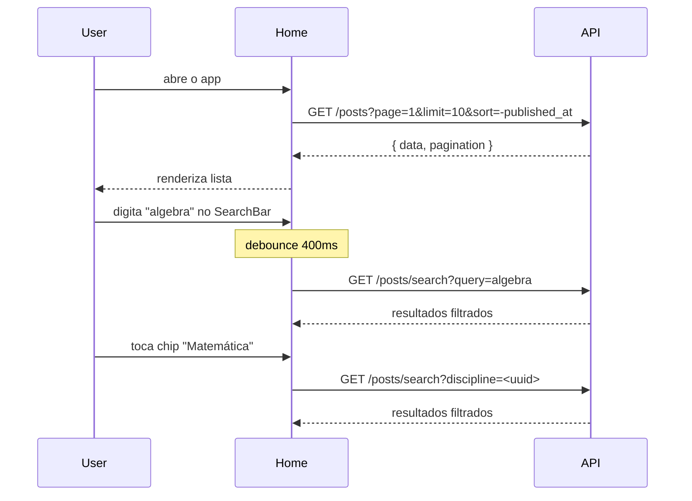
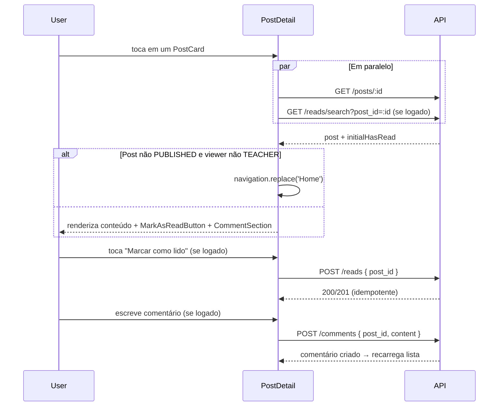
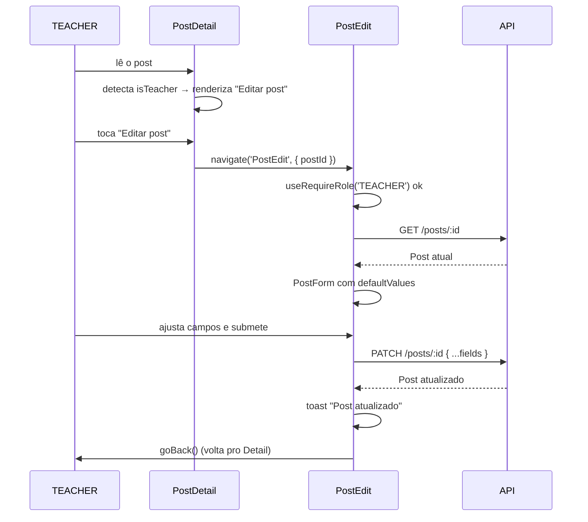

# Tech Challenge Fase 4 — Frontend Mobile (React Native)

Frontend mobile do sistema de blogging educacional, consumindo a API da Fase 2.

> **Status do projeto:** Em desenvolvimento — Fase 3 (Criação e Edição de Posts) concluída.

---

## Stack

| Camada | Tecnologia |
|--------|-----------|
| Runtime | Expo SDK 56 |
| Linguagem | TypeScript (strict) |
| Estilização | NativeWind v4 (Tailwind v3) |
| Forms | react-hook-form + Zod v4 |
| HTTP | Axios |
| Estado global | Context API (`AuthContext`) |
| Navegação | React Navigation v7 (Native Stack) |
| Armazenamento seguro | expo-secure-store |
| Testes | Jest + @testing-library/react-native |

## Setup

### Pré-requisitos

- Node.js 20+ (recomendado: 20.19.x ou 22.x)
- npm 9+
- Backend da Fase 2 rodando e acessível

### Passos

```bash
# 1. Instalar dependências
npm install

# 2. Configurar variáveis de ambiente
cp .env.example .env
# Edite .env e ajuste EXPO_PUBLIC_API_URL conforme o ambiente:
#   - iOS simulator / web: http://localhost:3030
#   - Android emulator:    http://10.0.2.2:3030
#   - Dispositivo físico:  http://<IP-DO-HOST>:3030

# 3. Subir o backend da Fase 2 (em outro terminal)

# 4. Iniciar o app
npm start
# Pressione 'i' (iOS), 'a' (Android) ou 'w' (web)
```

### Variáveis de ambiente

| Variável | Descrição | Obrigatória |
|----------|-----------|-------------|
| `EXPO_PUBLIC_API_URL` | URL base da API da Fase 2 | Sim |

## Scripts

```bash
npm start          # Inicia o Metro bundler
npm run android    # Inicia no Android emulator
npm run ios        # Inicia no iOS simulator
npm test           # Roda testes com Jest
npm run test:watch # Watch mode
npm run lint       # ESLint (via expo lint)
```

## Topologia de navegação

O app abre **direto na lista de posts pública** (rota `Home`). Não há "login wall" — qualquer pessoa (anônimo, STUDENT ou TEACHER) pode abrir o app e navegar pelo conteúdo público.

Login é uma rota acessada via botão "Entrar" no header. Ele existe principalmente para desbloquear o painel administrativo (TEACHER).

```
RootStack (Native Stack único)
│
├── Home          (pública — entry point)
├── Login         (pública — acessada via "Entrar")
├── AdminStub     (TEACHER-only — auto-redirect para Home se não-TEACHER)
├── PostDetail    (pública — redireciona Home se DRAFT/ARCHIVED e não-TEACHER)
├── PostCreate    (TEACHER-only — gated via useRequireRole)
└── PostEdit      (TEACHER-only — gated via useRequireRole, carrega post por id)
```

Rotas TEACHER-only não são "escondidas" do navigator — o hook `useRequireRole` faz auto-gate no `useEffect`: se `user.role !== 'TEACHER'`, dispara Toast informativo + `navigation.replace('Home')`. A tela retorna `null` enquanto o redirect acontece.

## Autenticação

A API da Fase 2 (branch `ajustes-fase-4`) utiliza **autenticação com `login` + senha (bcrypt)** e responde com **credencial separada do perfil**:

```
POST /auth/login { login, password }
   ↓
200 { user, profile, token }
   ↓
SecureStore.setItem (AUTH_TOKEN, AUTH_USER, AUTH_PROFILE)
   ↓
AuthContext atualiza estado → HeaderRight troca "Entrar" por "Sair" (+ "Painel" se TEACHER)
```

- **`user`** é a credencial: `{ id, login, role }`. Sem `name`, sem `email`.
- **`profile`** é `Teacher | Student | null` — onde estão os campos de exibição (`name`, `email`, `pronouns`, `disciplines`, `course`, etc.).
- **`token`** é o JWT (24h, sem refresh).

Na inicialização do app, o `AuthContext` faz **hydration** lendo as 3 chaves do SecureStore. Logout limpa as 3 chaves.

Em qualquer 401 (token expirado, sessão invalidada server-side, credencial removida), o interceptor do Axios e o handler do AuthContext limpam o estado local e redirecionam para a tela de login.

### Matriz de RBAC por ação

| Ação | Anônimo | STUDENT | TEACHER |
|------|:-------:|:-------:|:-------:|
| Ver lista de posts (só PUBLISHED) | ✅ | ✅ | ✅ (+DRAFT, +ARCHIVED) |
| Buscar / filtrar por disciplina | ✅ | ✅ | ✅ |
| Ler post (só PUBLISHED) | ✅ | ✅ | ✅ (qualquer status) |
| Ver lista de comentários | ✅ | ✅ | ✅ |
| **Criar comentário** | ❌ (backend retorna 401; CTA "Faça login") | ✅ | ✅ |
| Excluir próprio comentário | ❌ | ✅ | ✅ |
| Excluir qualquer comentário | ❌ | ❌ | ✅ |
| **Marcar post como lido** | ❌ (botão não renderiza) | ✅ | ✅ |
| Acessar painel admin | ❌ | ❌ | ✅ |
| **Criar post** (`POST /posts`) | ❌ | ❌ | ✅ |
| **Editar post** (`PATCH /posts/:id`) | ❌ | ❌ | ✅ |
| Ver página do grupo | ✅ | ✅ | ✅ |

### Troca de senha

`PATCH /auth/password { current_password, new_password }` está disponível e exposto pelo método `changePassword` do `auth.service`. UI é entregue na Fase 6.

## Fluxos por requisito

### Req 1 — Lista de posts com busca e filtro



### Req 2 — Leitura de post + comentários + marcar como lido



### Req 3 — Criar post (TEACHER)

```mermaid
sequenceDiagram
    participant T as TEACHER
    participant Admin as AdminStub
    participant Create as PostCreate
    participant API

    T->>Admin: toca "Painel" no header
    Admin->>T: renderiza placeholder
    T->>Admin: toca "+ Novo post"
    Admin->>Create: navigate('PostCreate')
    Create->>Create: useRequireRole('TEACHER') ok
    T->>Create: preenche form e submete
    Create->>API: POST /posts { title, content, status, discipline_id? }
    alt 201 Created
        API-->>Create: Post criado
        Create->>Create: toast "Post criado"
        Create->>T: navigate('PostDetail', { postId, title })
    else 401
        API-->>Create: Sessão expirada
        Create->>Create: logout() + replace('Login')
    else 403
        API-->>Create: Acesso negado
        Create->>Create: replace('Home') + toast
    end
```

### Req 4 — Editar post (TEACHER)



## Decisões arquiteturais (ADRs)

Algumas escolhas divergem do conteúdo padrão das aulas — registradas aqui para transparência.

| ADR | Decisão | Motivo |
|-----|---------|--------|
| 01 | **Expo SDK 56 (managed workflow)** em vez de React Native CLI | DX mais rápido, OTA via EAS, builds sem Xcode/Android Studio nativos para a maior parte do ciclo. |
| 02 | **NativeWind v4** em vez de `StyleSheet.create` ensinado em aula | Continuidade visual com a Fase 3 (Tailwind) e produtividade. |
| 03 | **react-hook-form + Zod** em vez de inputs controlados manuais | Mesmo pattern adotado na Fase 3; menos re-renders e inferência TS automática. |
| 04 | **Context API (`AuthContext`)** em vez de Redux Toolkit (aula RN Medium 6) | Um único reducer (auth) não justifica boilerplate de Redux. Spec da Fase 4 permite Context. |
| 05 | **expo-secure-store** para o JWT, em vez de AsyncStorage | SecureStore criptografa nativamente (Keychain no iOS, Keystore no Android). |
| 06 | **Single Native Stack com entrada pública**, não login wall | Espelha o modelo da Fase 3 web (lista de posts é pública; login é opcional). Rotas TEACHER-only fazem auto-gate via `useEffect + navigation.replace`. |
| 12 | **Credencial separada do perfil (`User` ≠ `Profile`)** | Espelhamento do backend Fase 2 (branch `ajustes-fase-4`). Mobile guarda 3 chaves SecureStore (`AUTH_TOKEN`, `AUTH_USER`, `AUTH_PROFILE`). `AuthContext` expõe ambos; UI usa `user.role` para gating e `profile.name` para exibição. |
| 13 | **Referências FHIR (`Teacher/<uuid>`, `Student/<uuid>`)** | IDs de perfil incluem o tipo no formato FHIR. Concatenar direto nas URLs (`/teachers/${teacher.id}`) — backend resolve. **Não** usar `encodeURIComponent` no id inteiro (quebraria a barra). |
| 07 | **`comments_count`/`reads_count` no shape de Post** (não chamadas extras) | Backend já retorna esses contadores em toda resposta de Post. PostCard e PostDetail usam sem chamada adicional. |
| 08 | **Disciplines com fallback hardcoded para anônimos** | `GET /disciplines` exige Bearer; o filtro de disciplina precisa funcionar para visitantes. Solução: array `SEED_DISCIPLINES` com UUIDs estáveis do seed da Fase 2. |
| 09 | **Comentário criação só autenticada** (regra do backend) | A Fase 2 removeu o fluxo anônimo de comentários: `POST /comments` agora exige Bearer (401 sem token). Mobile mostra CTA "Faça login para comentar" para anônimos. |
| 14 | **Display de autor com pronouns** | `Post.author` carrega `pronouns` do perfil do TEACHER. Exibimos como `Nome (pronome)` no PostDetail quando presente, omitimos quando `null`. |
| 15 | **`CommentAuthor.type` para distinguir Teacher/Student** | Backend entrega `type` resolvido. Exibimos "Professor" / "Aluno" no `CommentItem` em vez de parsear o prefixo do FhirRef. |
| 10 | **`useRequireRole` hook** em vez de lógica inline por tela | Mesmo gate é usado em AdminStub, PostCreate, PostEdit (e Fases 4 e 5 vão reusar). Centralizar evita drift de comportamento entre telas. |
| 11 | **Sem ownership check no client** (qualquer TEACHER pode editar qualquer post) | Espelhamento exato do backend (Fase 2 §2.1). Botão "Editar post" renderiza pra qualquer TEACHER, independente de quem é o autor. |

## Próximas fases

- ✅ Fase 1 — Fundação + Login
- ✅ Fase 2 — Posts: leitura (lista, busca, detalhe, comentários, reads)
- ✅ Fase 3 — Posts: escrita para professor (criar/editar)
- Fase 4 — Posts: administração (lista admin + delete)
- Fase 5 — Usuários: CRUD de professores e alunos

## Equipe

Grupo 28 — turma 8FSDT (FIAP).
