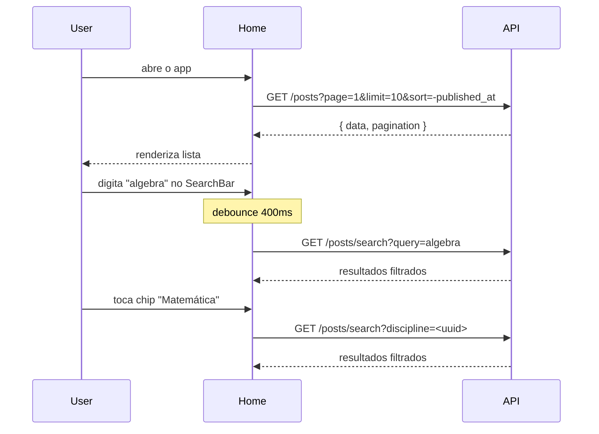
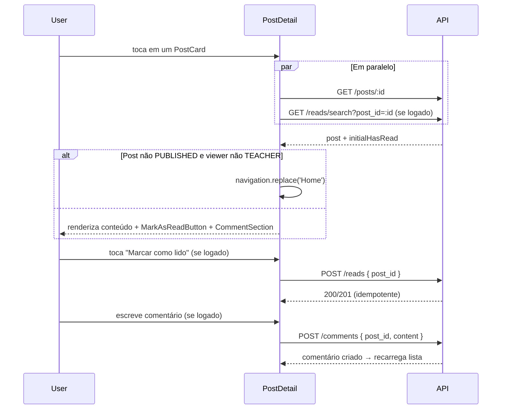
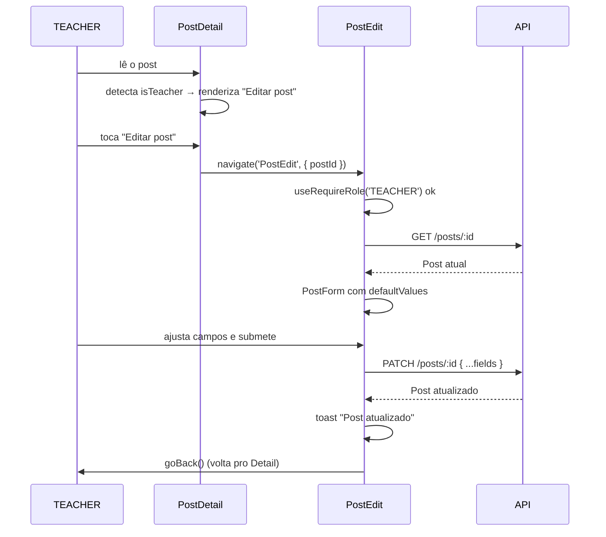
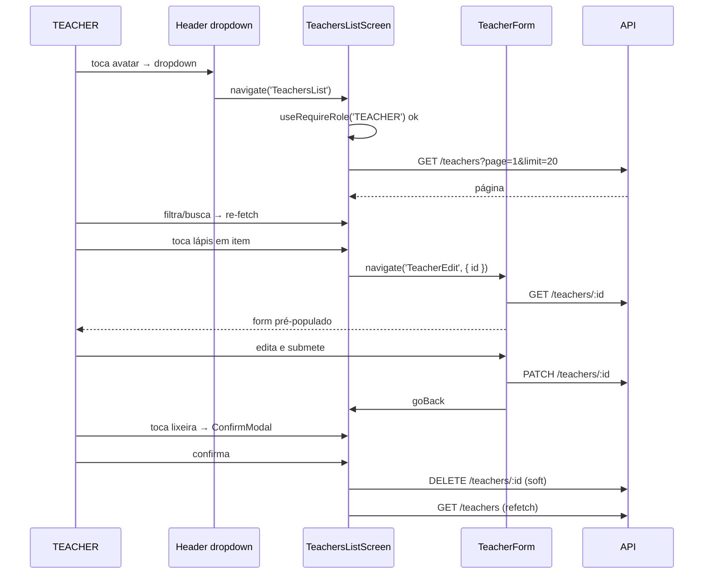
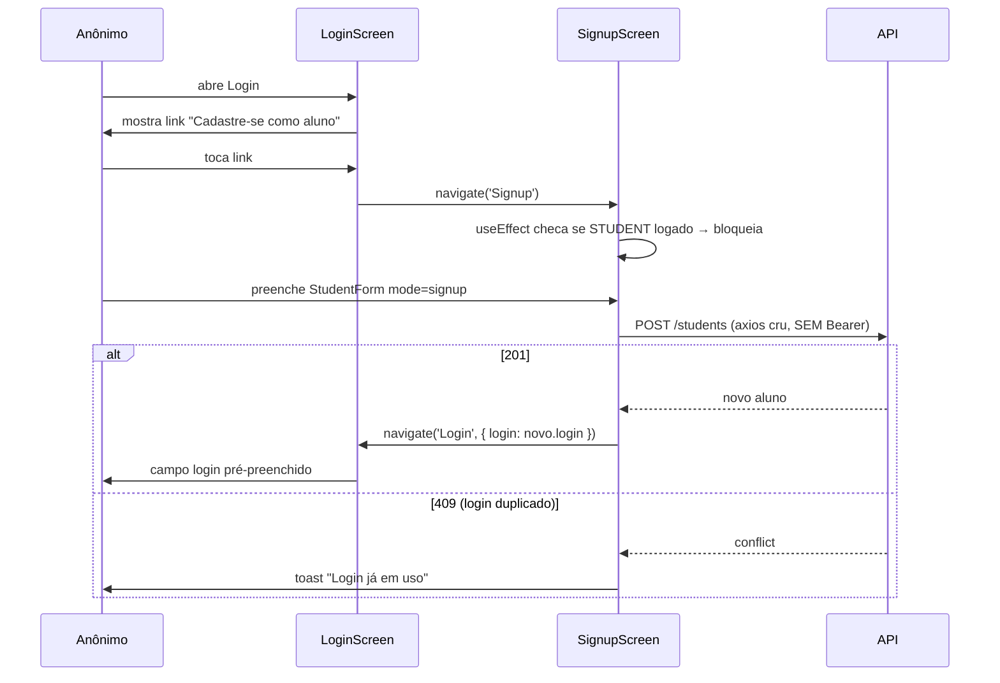
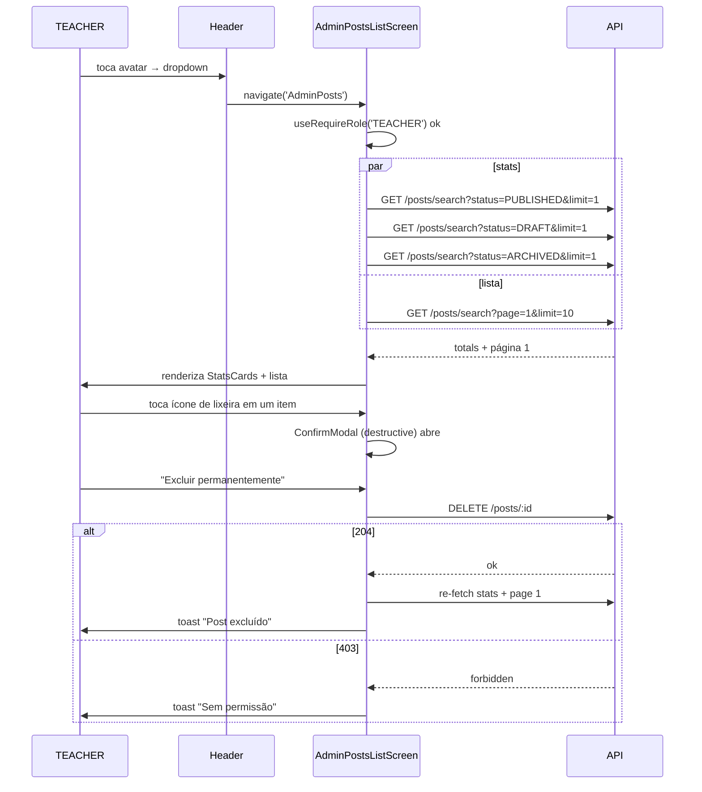

# Tech Challenge Fase 4 — Frontend Mobile (React Native)

Frontend mobile do sistema de blogging educacional, consumindo a API da Fase 2.

> **Status do projeto:** Em desenvolvimento — Fase 5 (CRUD de Professores e Alunos + Signup) concluída.

---

## Stack

| Camada | Tecnologia |
|--------|-----------|
| Runtime | Expo SDK 56 |
| Linguagem | TypeScript (strict) |
| Estilização | NativeWind v4 (Tailwind v3) |
| Forms | react-hook-form + Zod v4 |
| HTTP | Axios |
| Estado global | Context API (`AuthContext`) |
| Navegação | React Navigation v7 (Native Stack) |
| Armazenamento seguro | expo-secure-store |
| Testes | Jest + @testing-library/react-native |

## 🚀 Setup e Instalação

### Pré-requisitos

- **Node.js 20+** ([Download](https://nodejs.org/)) — recomendado: 20.19.x ou 22.x
- **npm 9+** (incluído com Node.js 20)
- **Expo Go** instalado no dispositivo móvel ([Android](https://play.google.com/store/apps/details?id=host.exp.exponent) · [iOS](https://apps.apple.com/app/expo-go/id982107779)) **ou** Android Studio com um AVD configurado
- **API da Fase 2** rodando e acessível ([Repositório](https://github.com/natanjunior/8FSDT-tech-challenge-2))

### 1. Clonar o Repositório

```bash
git clone https://github.com/natanjunior/8FSDT-tech-challenge-4.git
cd 8FSDT-tech-challenge-4
```

### 2. Instalar Dependências

```bash
npm install
```

### 3. Configurar Variáveis de Ambiente

```bash
cp .env.example .env
```

Edite `.env` ajustando `EXPO_PUBLIC_API_URL` para o endereço onde a API da Fase 2 está rodando. O valor correto **depende de como você está executando o app**:

| Cenário | Valor de `EXPO_PUBLIC_API_URL` |
|---------|-------------------------------|
| **Expo Go no dispositivo físico** (Android ou iOS) na mesma rede Wi-Fi | `http://<IP-LAN-DO-SEU-COMPUTADOR>:3030` |
| **Android Emulator** (Android Studio AVD) | `http://10.0.2.2:3030` |
| **iOS Simulator** (macOS) | `http://localhost:3030` |

> **Como descobrir o IP LAN do seu computador:**
> - **Windows:** abra o terminal e rode `ipconfig`. Procure "Endereço IPv4" na rede ativa (Wi-Fi). Exemplo: `192.168.0.173`
> - **macOS/Linux:** `ifconfig | grep "inet "` ou `ip addr`. Procure o IP da interface `en0` / `wlan0`.
>
> O IP deve ser o da mesma rede Wi-Fi em que o celular está conectado. Exemplo de `.env` final:
> ```env
> EXPO_PUBLIC_API_URL=http://192.168.0.173:3030
> ```

> **Importante — variáveis `EXPO_PUBLIC_*`:** essas variáveis são embutidas no bundle JavaScript pelo Metro bundler no momento da inicialização. Sempre que alterar o `.env`, reinicie o servidor com `npm start -- --clear` (ou `npx expo start --clear`) para o novo valor ser aplicado.

### 4. Subir o Backend da Fase 2

Em outro terminal, siga o [README da Fase 2](https://github.com/natanjunior/8FSDT-tech-challenge-2) para subir a API localmente. Ela precisa estar acessível na porta `3030` (ou na porta que você configurou em `EXPO_PUBLIC_API_URL`).

> **Nota — cold start da Render (free tier):** se o backend estiver hospedado na Render.com, o serviço hiberna após ~15 min de inatividade e leva 20–40s para acordar no primeiro request. O cliente Axios está configurado com `timeout: 30000ms` para cobrir esse cenário. Se o primeiro login demorar, aguarde e tente novamente — é o backend acordando.

### 5. Iniciar o App

```bash
npm start
```

O terminal exibe um QR Code. Escolha como rodar:

| Método | O que fazer |
|--------|------------|
| **Expo Go no celular** | Abra o app Expo Go, toque em "Scan QR code" e aponte para o QR do terminal |
| **Android Emulator** | Com o AVD aberto no Android Studio, pressione `a` no terminal |
| **iOS Simulator** (macOS) | Pressione `i` no terminal |

### Variáveis de Ambiente

| Variável | Descrição | Padrão | Obrigatória |
|----------|-----------|--------|-------------|
| `EXPO_PUBLIC_API_URL` | URL base da API da Fase 2 (sem barra final) | `http://localhost:3030` | Sim |

### Scripts Disponíveis

| Script | Descrição |
|--------|-----------|
| `npm start` | Inicia o Metro bundler (Expo Dev Server) |
| `npm run android` | Inicia diretamente no Android Emulator |
| `npm run ios` | Inicia diretamente no iOS Simulator |
| `npm test` | Roda testes com Jest (execução única) |
| `npm run test:watch` | Testes em watch mode |
| `npm run lint` | ESLint via Expo |

## Topologia de navegação

O app abre **direto na lista de posts pública** (rota `Home`). Não há "login wall" — qualquer pessoa (anônimo, STUDENT ou TEACHER) pode abrir o app e navegar pelo conteúdo público.

Login é uma rota acessada via botão "Entrar" no header. Ele existe principalmente para desbloquear o painel administrativo (TEACHER).

```
RootStack (Native Stack único)
│
├── Home             (pública — entry point)
├── Login            (pública — acessada via "Entrar")
├── Signup           (pública — auto-cadastro de aluno; bloqueia STUDENT já logado)
├── AdminStub        (TEACHER-only — auto-redirect para Home se não-TEACHER)
├── AdminPosts       (TEACHER-only — lista admin com stats + delete)
├── PostDetail       (pública — redireciona Home se DRAFT/ARCHIVED e não-TEACHER)
├── PostCreate       (TEACHER-only — gated via useRequireRole)
├── PostEdit         (TEACHER-only — gated via useRequireRole, carrega post por id)
├── TeachersList     (TEACHER-only — lista paginada com busca, editar e excluir)
├── TeacherCreate    (TEACHER-only — cria novo professor)
├── TeacherEdit      (TEACHER-only — edita professor existente por id)
├── StudentsList     (TEACHER-only — lista paginada com busca, editar e excluir)
├── StudentCreate    (TEACHER-only — cria novo aluno)
└── StudentEdit      (TEACHER-only — edita aluno existente por id)
```

Rotas TEACHER-only não são "escondidas" do navigator — o hook `useRequireRole` faz auto-gate no `useEffect`: se `user.role !== 'TEACHER'`, dispara Toast informativo + `navigation.replace('Home')`. A tela retorna `null` enquanto o redirect acontece.

## Autenticação

A API da Fase 2 (branch `ajustes-fase-4`) utiliza **autenticação com `login` + senha (bcrypt)** e responde com **credencial separada do perfil**:

```
POST /auth/login { login, password }
   ↓
200 { user, profile, token }
   ↓
SecureStore.setItem (AUTH_TOKEN, AUTH_USER, AUTH_PROFILE)
   ↓
AuthContext atualiza estado → HeaderRight troca "Entrar" por "Sair" (+ "Painel" se TEACHER)
```

- **`user`** é a credencial: `{ id, login, role }`. Sem `name`, sem `email`.
- **`profile`** é `Teacher | Student | null` — onde estão os campos de exibição (`name`, `email`, `pronouns`, `disciplines`, `course`, etc.).
- **`token`** é o JWT (24h, sem refresh).

Na inicialização do app, o `AuthContext` faz **hydration** lendo as 3 chaves do SecureStore. Logout limpa as 3 chaves.

Em qualquer 401 (token expirado, sessão invalidada server-side, credencial removida), o interceptor do Axios e o handler do AuthContext limpam o estado local e redirecionam para a tela de login.

### Matriz de RBAC por ação

| Ação | Anônimo | STUDENT | TEACHER |
|------|:-------:|:-------:|:-------:|
| Ver lista de posts (só PUBLISHED) | ✅ | ✅ | ✅ (+DRAFT, +ARCHIVED) |
| Buscar / filtrar por disciplina | ✅ | ✅ | ✅ |
| Ler post (só PUBLISHED) | ✅ | ✅ | ✅ (qualquer status) |
| Ver lista de comentários | ✅ | ✅ | ✅ |
| **Criar comentário** | ❌ (backend retorna 401; CTA "Faça login") | ✅ | ✅ |
| Excluir próprio comentário | ❌ | ✅ | ✅ |
| Excluir qualquer comentário | ❌ | ❌ | ✅ |
| **Marcar post como lido** | ❌ (botão não renderiza) | ✅ | ✅ |
| Acessar painel admin | ❌ | ❌ | ✅ |
| **Criar post** (`POST /posts`) | ❌ | ❌ | ✅ |
| **Editar post** (`PATCH /posts/:id`) | ❌ | ❌ | ✅ |
| **Excluir post** (`DELETE /posts/:id`) | ❌ | ❌ | ✅ |
| **Listar todos os posts (admin)** (`GET /posts/search`) | ❌ | ❌ | ✅ (vê todos os status) |
| **CRUD /teachers** (`GET/POST/PATCH/DELETE`) | ❌ | ❌ | ✅ |
| **CRUD /students** (`GET/PATCH/DELETE`) | ❌ | ❌ | ✅ |
| **`POST /students` (auto-cadastro)** | ✅ (sem Bearer) | ❌ (403) | ❌ |
| **`PATCH /students/:id` próprio** | ❌ | ✅ (próprio) | ✅ |
| **`PATCH /teachers/:id` próprio** | ❌ | — | ✅ (próprio ou outro) |
| Ver página do grupo | ✅ | ✅ | ✅ |

### Troca de senha

`PATCH /auth/password { current_password, new_password }` está disponível e exposto pelo método `changePassword` do `auth.service`. UI é entregue na Fase 6.

## Fluxos por requisito

### Req 1 — Lista de posts com busca e filtro



### Req 2 — Leitura de post + comentários + marcar como lido



### Req 3 — Criar post (TEACHER)

```mermaid
sequenceDiagram
    participant T as TEACHER
    participant Admin as AdminStub
    participant Create as PostCreate
    participant API

    T->>Admin: toca "Painel" no header
    Admin->>T: renderiza placeholder
    T->>Admin: toca "+ Novo post"
    Admin->>Create: navigate('PostCreate')
    Create->>Create: useRequireRole('TEACHER') ok
    T->>Create: preenche form e submete
    Create->>API: POST /posts { title, content, status, discipline_id? }
    alt 201 Created
        API-->>Create: Post criado
        Create->>Create: toast "Post criado"
        Create->>T: navigate('PostDetail', { postId, title })
    else 401
        API-->>Create: Sessão expirada
        Create->>Create: logout() + replace('Login')
    else 403
        API-->>Create: Acesso negado
        Create->>Create: replace('Home') + toast
    end
```

### Req 4 — Editar post (TEACHER)



### Req 5/6 — Gerenciamento de professores e alunos (TEACHER)



### Req 7 — Criação admin de aluno (TEACHER)

Pattern idêntico a Req 5/6 com `StudentsList`/`StudentCreate`/`StudentEdit`. `course` (texto livre) substitui `discipline_ids`.

### Req 8 — Auto-cadastro de aluno (público)



### Req 9 — Painel administrativo de posts (TEACHER)



## Decisões arquiteturais (ADRs)

Algumas escolhas divergem do conteúdo padrão das aulas — registradas aqui para transparência.

| ADR | Decisão | Motivo |
|-----|---------|--------|
| 01 | **Expo SDK 56 (managed workflow)** em vez de React Native CLI | DX mais rápido, OTA via EAS, builds sem Xcode/Android Studio nativos para a maior parte do ciclo. |
| 02 | **NativeWind v4** em vez de `StyleSheet.create` ensinado em aula | Continuidade visual com a Fase 3 (Tailwind) e produtividade. |
| 03 | **react-hook-form + Zod** em vez de inputs controlados manuais | Mesmo pattern adotado na Fase 3; menos re-renders e inferência TS automática. |
| 04 | **Context API (`AuthContext`)** em vez de Redux Toolkit (aula RN Medium 6) | Um único reducer (auth) não justifica boilerplate de Redux. Spec da Fase 4 permite Context. |
| 05 | **expo-secure-store** para o JWT, em vez de AsyncStorage | SecureStore criptografa nativamente (Keychain no iOS, Keystore no Android). |
| 06 | **Single Native Stack com entrada pública**, não login wall | Espelha o modelo da Fase 3 web (lista de posts é pública; login é opcional). Rotas TEACHER-only fazem auto-gate via `useEffect + navigation.replace`. |
| 12 | **Credencial separada do perfil (`User` ≠ `Profile`)** | Espelhamento do backend Fase 2 (branch `ajustes-fase-4`). Mobile guarda 3 chaves SecureStore (`AUTH_TOKEN`, `AUTH_USER`, `AUTH_PROFILE`). `AuthContext` expõe ambos; UI usa `user.role` para gating e `profile.name` para exibição. |
| 13 | **Referências FHIR (`Teacher/<uuid>`, `Student/<uuid>`)** | IDs de perfil incluem o tipo no formato FHIR. Concatenar direto nas URLs (`/teachers/${teacher.id}`) — backend resolve. **Não** usar `encodeURIComponent` no id inteiro (quebraria a barra). |
| 07 | **`comments_count`/`reads_count` no shape de Post** (não chamadas extras) | Backend já retorna esses contadores em toda resposta de Post. PostCard e PostDetail usam sem chamada adicional. |
| 08 | **Disciplines com fallback hardcoded para anônimos** | `GET /disciplines` exige Bearer; o filtro de disciplina precisa funcionar para visitantes. Solução: array `SEED_DISCIPLINES` com UUIDs estáveis do seed da Fase 2. |
| 09 | **Comentário criação só autenticada** (regra do backend) | A Fase 2 removeu o fluxo anônimo de comentários: `POST /comments` agora exige Bearer (401 sem token). Mobile mostra CTA "Faça login para comentar" para anônimos. |
| 14 | **Display de autor com pronouns** | `Post.author` carrega `pronouns` do perfil do TEACHER. Exibimos como `Nome (pronome)` no PostDetail quando presente, omitimos quando `null`. |
| 15 | **`CommentAuthor.type` para distinguir Teacher/Student** | Backend entrega `type` resolvido. Exibimos "Professor" / "Aluno" no `CommentItem` em vez de parsear o prefixo do FhirRef. |
| 10 | **`useRequireRole` hook** em vez de lógica inline por tela | Mesmo gate é usado em AdminStub, PostCreate, PostEdit (e Fases 4 e 5 vão reusar). Centralizar evita drift de comportamento entre telas. |
| 11 | **Sem ownership check no client** (qualquer TEACHER pode editar qualquer post) | Espelhamento exato do backend (Fase 2 §2.1). Botão "Editar post" renderiza pra qualquer TEACHER, independente de quem é o autor. |
| 16 | **Inter (6 pesos) + JetBrains Mono via `@expo-google-fonts`** + SplashScreen gate | Paridade visual direta com a Fase 3 web. Inter 900 é necessário para títulos editoriais do PostDetail; JetBrains Mono é o sistema de metadata (timestamps, contadores, IDs) que o web usa sistematicamente. SplashScreen gate evita FOUT (flash of unstyled text). |
| 17 | **`@expo/vector-icons / MaterialCommunityIcons`** em vez de Material Symbols (que o web usa) | Material Symbols não é fonte instalável em RN sem hacks. MaterialCommunityIcons (6k+ ícones) já vem com Expo SDK 56, tem cobertura comparável e visual Material Design. Wrapper `<Icon>` com enum `IconName` força mapeamento tipado e centraliza os ≈25 ícones usados no app — typos pegam em compile time. |
| 18 | **`expo-linear-gradient`** para CTAs (`Button primary` e `Button nav`) | Espelhamento dos `cta-gradient` (teal) e `primary-gradient` (navy) do web. NativeWind não suporta gradientes nativamente; expo-linear-gradient é a API canônica do Expo e tem custo de bundle desprezível (~30KB). |
| 19 | **Comment avatar usa ícone `account`**, NÃO iniciais — divergência intencional do PostCard's AuthorId | Espelhamento exato do web (CommentItem.tsx usa Material Symbol `person`, não iniciais; PostCard.tsx usa iniciais). A diferença semântica: no PostCard, o autor é a identidade editorial (nome + iniciais reforçam isso); no comentário, o autor é um ator transitivo dentro de uma discussão (ícone neutro pesa menos). |
| 20 | **Stats via 3 chamadas paralelas a `searchPosts(status=X, limit=1)`** em vez de um endpoint de estatísticas dedicado | Backend não expõe `/posts/stats`. As 3 chamadas com `limit=1` lêem só `pagination.total`, o que é barato (apenas COUNT(*) no SQL). Falha silenciosa nas stats não bloqueia a lista — degradação aceita. |
| 21 | **`signupStudent` usa `axios` cru em vez do `apiClient` interceptado** | O interceptor de request do `apiClient` injeta `Authorization: Bearer <token>` quando há sessão. O endpoint `POST /students` é público e o backend retorna 403 quando recebe um Bearer de STUDENT logado (regra de produto: STUDENT não pode "se recadastrar"). Usar `axios.post(\`${API_BASE_URL}/students\`, ...)` direto evita o header e mantém o endpoint genuinamente público. |

## Design System

### Tipografia

Inter (sans) + JetBrains Mono (monospace para metadata) via [`@expo-google-fonts`](https://github.com/expo/google-fonts), carregadas no boot (SplashScreen gate em `App.tsx`).

| Classe Tailwind | Family | Peso |
|-----------------|--------|------|
| `font-sans` | Inter | 400 |
| `font-sans-medium` | Inter | 500 |
| `font-sans-semibold` | Inter | 600 |
| `font-sans-bold` | Inter | 700 |
| `font-sans-extrabold` | Inter | 800 |
| `font-sans-black` | Inter | 900 |
| `font-jetbrains` | JetBrains Mono | 400 |

Inter Black (900) é usado em títulos editoriais (PostDetail, headlines); ExtraBold (800) em títulos de PostCard; JetBrains Mono em **toda metadata** (timestamps, contadores, IDs).

### Iconografia

[`@expo/vector-icons` / `MaterialCommunityIcons`](https://icons.expo.fyi/Index) — wrapper em [src/components/ui/Icon.tsx](src/components/ui/Icon.tsx) restringe nomes a uma enum tipada (`IconName`).

**Mapeamento aproximado Material Symbols (web) → MaterialCommunityIcons (mobile):** aproximação visual, não 1:1 — ver ADR 17.

### Paleta M3 (alinhada à Fase 3 web)

(Mesma tabela das fases anteriores, mantida.)

**Status colors** (divergem dos M3 success/warning/neutral — são específicos do DS web):
| Token | Hex | Uso |
|-------|-----|-----|
| `status-published` | `#22C55E` | PUBLISHED badge + dot |
| `status-draft` | `#EAB308` | DRAFT badge + dot |
| `status-archived` | `#94A3B8` | ARCHIVED badge + dot |

**Paleta `AuthorAvatar`:** 6 cores pastel (blue/emerald/teal/amber/rose/violet) — escolha determinística por hash do nome. Fallback slate para nomes nulos.

### Disciplinas — referência única

Mapping `label → { icon, color }` em [src/lib/disciplines.ts](src/lib/disciplines.ts):

| Disciplina | Icon | Cor |
|-----------|------|-----|
| Matemática | `function-variant` | `#2563EB` (blue-600) |
| Português | `book-open-page-variant-outline` | `#D97706` (amber-600) |
| Ciências | `flask-outline` | `#059669` (emerald-600) |
| História | `book-clock` | `#E11D48` (rose-600) |
| Geografia | `earth` | `#0D9488` (teal-600) |

### Componentes (props notáveis)

| Componente | Props |
|-----------|-------|
| `Button` | `variant: 'primary' \| 'nav' \| 'secondary' \| 'danger' \| 'danger-outline'`, `size: 'sm' \| 'md' \| 'lg'`, `leadingIcon`, `trailingIcon`, `loading`. `primary`/`nav` usam `expo-linear-gradient` (cta-gradient teal e primary-gradient navy). |
| `Input` | `label`, `error`, `hint`, `leadingIcon`, `trailingIcon`, `onTrailingIconPress`. Erro **sem borda vermelha**, só background shift. |
| `Card` | `elevation: 'none' \| 'soft' \| 'editorial'` (default `editorial`). |
| `Spinner` | `size: 'sm' \| 'md'` (Animated.loop com rotate). |
| `Loader` | `message`, `fullScreen`. Usa Spinner internamente. |
| `EmptyState` | `title`, `subtitle`, `icon` (default `inbox-outline`, 64px), `action`. |
| `Skeleton` | `className` (Animated.pulse 0.4↔0.7). |
| `StatusBadge` | `status: 'PUBLISHED' \| 'DRAFT' \| 'ARCHIVED'`. Renderiza dot + label uppercase. |
| `DisciplineBadge` | `label`. Cor + label de `DISCIPLINE_META`. Fallback "Sem disciplina". |
| `AuthorAvatar` | `name`, `size: 'sm' \| 'md' \| 'lg'`, `variant: 'initials' \| 'icon'`. 6 cores pastel determinísticas. |
| `AuthorId` | `name`, `subtitle`, `date` (só `lg`), `size`, `avatarVariant`. Composite avatar + texto. |
| `IconCount` | `type: 'comment' \| 'bookmark' \| 'views'`, `count`, `size`. Ícone + número em JetBrains Mono. |
| `ConfirmModal` | `isOpen`, `title`, `description`, `confirmLabel`, `cancelLabel`, `variant: 'destructive' \| 'neutral'`, `onConfirm`, `onCancel`, `isLoading`. |
| `Icon` | `name: IconName`, `size`, `color`. Wrapper de MaterialCommunityIcons. |

### Regras visuais críticas (espelham o web)

1. **Botões primary usam gradient teal**, nunca `bg-primary` sólido.
2. **Inputs com erro NÃO têm borda vermelha** — só background `error-container/20` + texto de erro abaixo.
3. **"No 1px solid borders rule"** — separação de seções por tonal layering (`surface-container-low` vs `surface-container-lowest`). Quando 1px é necessário, usar hairlineWidth + `outline-variant/40` (ghost border).
4. **Cards usam `editorial-shadow`** (sombra navy 5% opacidade, blur 20px, offset 12px) — sem sombras pesadas.
5. **Metadata sempre em monospace** (`font-jetbrains`) — timestamps, contadores, IDs.
6. **Comment avatar usa ícone `account`**, NUNCA iniciais (divergência intencional do PostCard's AuthorId — espelha o web, ADR 19).

### Como adicionar um novo ícone

1. Conferir o nome em https://icons.expo.fyi/Index (`MaterialCommunityIcons`).
2. Adicionar ao tipo `IconName` em [src/components/ui/Icon.tsx](src/components/ui/Icon.tsx).
3. Usar: `<Icon name="novo-icone" size={20} color={colors.primary} />`.

## Próximas fases

- ✅ Fase 1 — Fundação + Login
- ✅ Fase 2 — Posts: leitura (lista, busca, detalhe, comentários, reads)
- ✅ Fase 3 — Posts: escrita para professor (criar/editar)
- ✅ Fase 4 — Posts: administração (lista admin + delete)
- ✅ Fase 5 — Usuários: CRUD de professores e alunos (req 5, 6, 7, 8)

## Dificuldades Encontradas

### 1. Validação Zod falha silenciosa em campos string vazios (formulários de professor/aluno)

**Problema:** campos `name`, `email` e `login` definidos como `z.string().min(1)` passavam na validação mesmo quando o usuário não tinha digitado nada. O valor entregue pelo `react-hook-form` para inputs não tocados era `""` (string vazia), que satisfaz `z.string()` mas deveria falhar em `.min(1)`. Em modo de edição, o campo pode também ser `undefined` antes do `reset(defaultValues)`.

**Tentativas:** aumentar o `.min(1)` para `.min(2)` foi descartado (nomes válidos de 1 letra existem). Usar `.refine(v => v.trim().length > 0)` funcionou mas gerou mensagens de erro fora de padrão.

**Solução final:** `z.preprocess(v => (typeof v === 'string' ? v.trim() : v), z.string().min(1, 'Campo obrigatório'))` — o `preprocess` normaliza o valor antes da validação, elimina espaços em branco e torna o `min(1)` confiável.

**Aprendizado:** `z.preprocess` deve ser o padrão para qualquer campo de texto obrigatório em formulários RHF+Zod no React Native, pois o input nativo entrega strings vazias (não `undefined`) para campos não preenchidos.

---

### 2. Conflito entre `jest-expo` e `@react-native/jest-preset` nos testes de Fase 5

**Problema:** ao rodar `npm test` após adicionar os specs das telas `TeachersListScreen` e `SignupScreen`, o Jest jogava `SyntaxError: Cannot use import statement in a module` para módulos internos do Expo (ex: `expo-secure-store`, `expo-linear-gradient`). A causa era que o `jest.config.js` herdado usava `preset: '@react-native/jest-preset'` diretamente, sem o wrapper `jest-expo` que já inclui as transformações necessárias para módulos nativos do Expo.

**Solução:** substituir o preset por `preset: 'jest-expo'` e mover as entradas de `transformIgnorePatterns` para a lista canônica recomendada pela documentação do Expo (`node_modules/(?!((jest-)?react-native|@react-native(-community)?)|expo(nent)?|@expo(nent)?/.*|...)`). Isso resolveu os erros de import sem afetar os testes das fases anteriores.

**Aprendizado:** projetos Expo devem sempre usar `jest-expo` como preset base — não combinar `@react-native/jest-preset` diretamente, mesmo que este seja o que os exemplos genéricos de React Native mostram.

---

### 3. Mock de `createInteropElement` necessário para NativeWind v4 nos testes

**Problema:** após resolver o preset, testes que renderizavam componentes estilizados com NativeWind falhavam com `TypeError: (0 , _reactNative.createElement) is not a function` ou `createInteropElement is not a function`. O NativeWind v4 substitui internamente o `createElement` por um wrapper (`createInteropElement`) que não é transpilado corretamente no ambiente de teste Jest (que não passa pelo Metro bundler).

**Solução:** adicionar em `jest.setup.js`:
```js
jest.mock('nativewind', () => ({
  ...jest.requireActual('nativewind'),
  styled: (Component) => Component,
}));
```
e mapear `nativewind/dist/style-sheet/native` para um stub vazio no `moduleNameMapper`. Componentes de teste passaram a usar `className` como prop simples sem processar o Tailwind.

**Aprendizado:** NativeWind v4 exige configuração extra de mock em Jest porque o seu babel plugin não é executado fora do Metro. O padrão é sempre ter um `__mocks__/nativewind.js` ou a entrada equivalente no `moduleNameMapper`.

---

### 4. Re-render infinito no `TeachersListScreen` causado por dependência de objeto em `useEffect`

**Problema:** a tela de listagem de professores entrava em loop de re-fetch logo após montar: o `useEffect` de busca declarava `[filters]` como dependência, mas `filters` era um objeto recriado a cada render pelo `useState` com valor inicial inline (`{ page: 1, limit: 20 }`). Como objetos são comparados por referência no JavaScript, o React detectava mudança a cada ciclo e re-disparava o efeito.

**Tentativas:** memoizar `filters` com `useMemo` resolveu o loop mas introduziu dependências circulares com o `setFilters` do state. Usar `useRef` para guardar o valor anterior foi descartado por aumentar a complexidade.

**Solução final:** separar os filtros em primitivos individuais (`page`, `query`, `limit`) no `useState`, e compor o objeto de query apenas dentro do `useEffect`, sem incluí-lo como dependência. Assim as dependências do efeito são apenas primitivos (`page`, `query`, `limit`), cuja comparação por valor é estável.

**Aprendizado:** nunca declarar objetos ou arrays como dependências de `useEffect` quando eles são recriados a cada render. Preferir primitivos como dependências e construir objetos compostos dentro do próprio efeito.

---

### 5. Endpoint `POST /students` retorna 403 para STUDENT logado (axios interceptor injetava Bearer)

**Problema:** ao testar o fluxo de auto-cadastro (`SignupScreen`) com um STUDENT já logado na sessão (cenário de regressão), a chamada `POST /students` retornava 403. O interceptor de request do `apiClient` injeta `Authorization: Bearer <token>` automaticamente sempre que há sessão no `AuthContext`. O backend Fase 2 interpreta o Bearer de um STUDENT como uma tentativa de "se recadastrar" e nega com 403 por regra de negócio.

**Solução:** usar `axios.post(\`${API_BASE_URL}/students\`, payload)` diretamente (sem o `apiClient`), de forma que nenhum header de autorização seja anexado. A `SignupScreen` também bloqueia STUDENTs já logados via `useEffect` (redireciona para Home), mas o uso de axios cru garante que a chamada seja genuinamente pública independentemente do estado da sessão. Registrado como ADR 21.

**Aprendizado:** interceptors de request são convenientes, mas têm efeito colateral em endpoints públicos que são sensíveis à presença do Bearer. Nesses casos, usar a instância base do axios (sem interceptor) é mais correto do que tentar remover o header dentro do interceptor por rota.

---

## Equipe

Grupo 28 — turma 8FSDT (FIAP).
