# Tech Challenge Fase 4 — Frontend Mobile (React Native)

Frontend mobile do sistema de blogging educacional, consumindo a API da Fase 2.

> **Status do projeto:** ✅ Fase 6 concluída — Tech Challenge Fase 4 entregue. Os 10 requisitos do enunciado + auto-cadastro de aluno + meu perfil + trocar senha estão funcionais.

## Sobre o Projeto

Frontend mobile (React Native + Expo) do sistema de blogging educacional do Tech Challenge da FIAP 8FSDT. Consome a API REST construída na Fase 2 e espelha os fluxos do frontend web da Fase 3, com dois papéis distintos: **TEACHER** (acesso total) e **STUDENT** (leitura + perfil próprio).

### Funcionalidades entregues

- **Leitura pública de posts** — lista paginada, busca por palavra-chave (debounce), filtro por disciplina, detalhe do post, comentários (criar/excluir conforme RBAC) e marcação de "lido".
- **Auto-cadastro de aluno** — fluxo público de signup (`POST /students` sem Bearer).
- **Login + meu perfil + trocar senha** — autenticação por `login`/senha, tela de perfil próprio (ver/editar) e troca de senha com validação cruzada.
- **TEACHER** — criar/editar/excluir posts, painel administrativo de posts (com estatísticas), CRUD completo de professores e CRUD de alunos.

### Capturas de tela

| Home | Header dropdown | Painel admin |
|------|------------------|--------------|
| 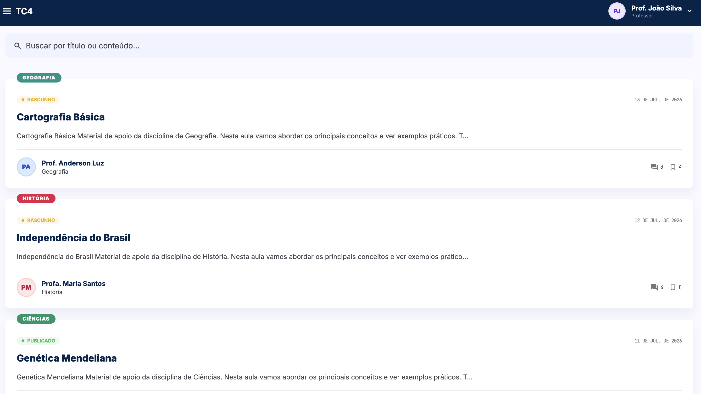 | 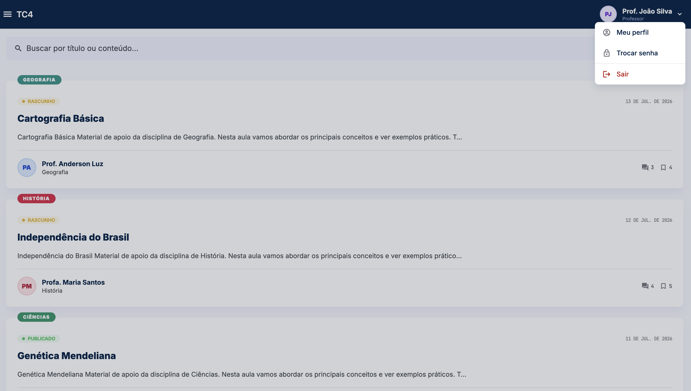 | 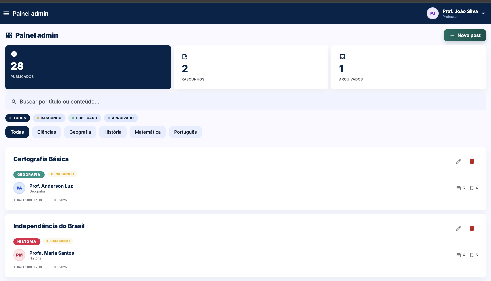 |

| Meu perfil | Trocar senha | Post (detalhe) | Post (comentários) |
|------------|--------------|-----------------|---------------------|
| 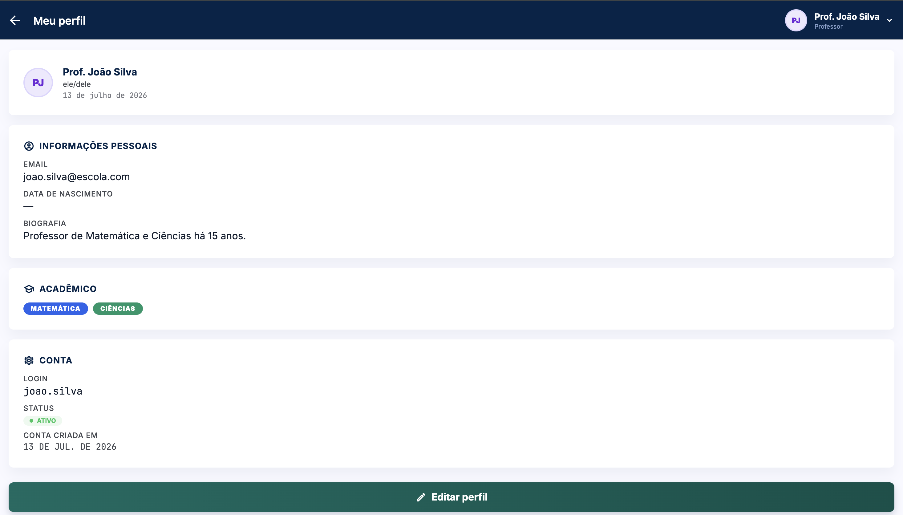 |  | 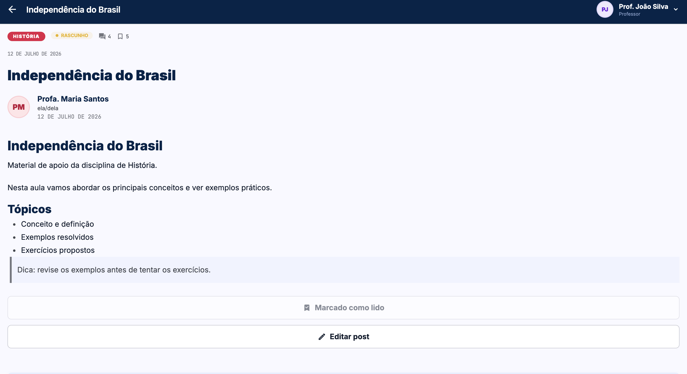 | 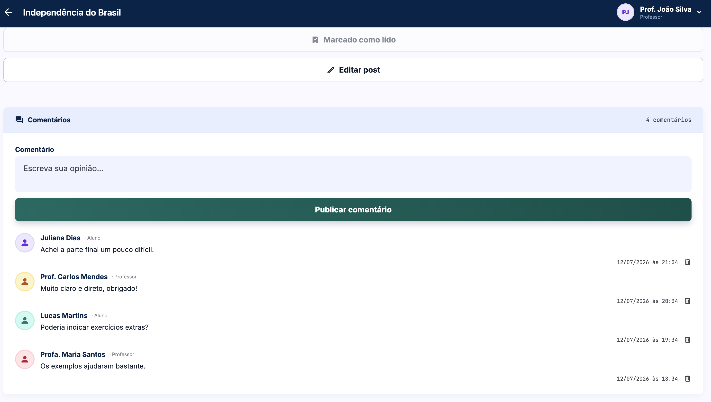 |

## Índice

- [Sobre o Projeto](#sobre-o-projeto)
- [Stack](#stack)
- [Setup e Instalação](#-setup-e-instalação)
- [Topologia de navegação](#topologia-de-navegação)
- [Autenticação](#autenticação)
- [Fluxos por requisito](#fluxos-por-requisito)
- [Decisões arquiteturais (ADRs)](#decisões-arquiteturais-adrs)
- [Design System](#design-system)
- [Testes](#testes)
- [Roadmap concluído](#roadmap-concluído)
- [Dificuldades Encontradas](#dificuldades-encontradas)
- [Equipe](#equipe)

---

## Stack

| Camada | Tecnologia |
|--------|-----------|
| Runtime | Expo SDK 56 |
| Linguagem | TypeScript (strict) |
| Estilização | NativeWind v4 (Tailwind v3) |
| Forms | react-hook-form + Zod v4 |
| HTTP | Axios |
| Estado global | Context API (`AuthContext`) |
| Navegação | React Navigation v7 (Drawer + Native Stack) |
| Armazenamento seguro | expo-secure-store |
| Testes | Jest + @testing-library/react-native |

## 🚀 Setup e Instalação

### Pré-requisitos

- **Node.js 20+** ([Download](https://nodejs.org/)) — recomendado: 20.19.x ou 22.x
- **npm 9+** (incluído com Node.js 20)
- **Expo Go** instalado no dispositivo móvel ([Android](https://play.google.com/store/apps/details?id=host.exp.exponent) · [iOS](https://apps.apple.com/app/expo-go/id982107779)) **ou** Android Studio com um AVD configurado
- **API da Fase 2** rodando e acessível ([Repositório](https://github.com/natanjunior/8FSDT-tech-challenge-2))

### 1. Clonar o Repositório

```bash
git clone https://github.com/natanjunior/8FSDT-tech-challenge-4.git
cd 8FSDT-tech-challenge-4
```

### 2. Instalar Dependências

```bash
npm install
```

### 3. Configurar Variáveis de Ambiente

```bash
cp .env.example .env
```

Edite `.env` ajustando `EXPO_PUBLIC_API_URL` para o endereço onde a API da Fase 2 está rodando. O valor correto **depende de como você está executando o app**:

| Cenário | Valor de `EXPO_PUBLIC_API_URL` |
|---------|-------------------------------|
| **Expo Go no dispositivo físico** (Android ou iOS) na mesma rede Wi-Fi | `http://<IP-LAN-DO-SEU-COMPUTADOR>:3030` |
| **Android Emulator** (Android Studio AVD) | `http://10.0.2.2:3030` |
| **iOS Simulator** (macOS) | `http://localhost:3030` |

> **Como descobrir o IP LAN do seu computador:**
> - **Windows:** abra o terminal e rode `ipconfig`. Procure "Endereço IPv4" na rede ativa (Wi-Fi). Exemplo: `192.168.0.173`
> - **macOS/Linux:** `ifconfig | grep "inet "` ou `ip addr`. Procure o IP da interface `en0` / `wlan0`.
>
> O IP deve ser o da mesma rede Wi-Fi em que o celular está conectado. Exemplo de `.env` final:
> ```env
> EXPO_PUBLIC_API_URL=http://192.168.0.173:3030
> ```

> **Importante — variáveis `EXPO_PUBLIC_*`:** essas variáveis são embutidas no bundle JavaScript pelo Metro bundler no momento da inicialização. Sempre que alterar o `.env`, reinicie o servidor com `npm start -- --clear` (ou `npx expo start --clear`) para o novo valor ser aplicado.

### 4. Subir o Backend da Fase 2

Em outro terminal, siga o [README da Fase 2](https://github.com/natanjunior/8FSDT-tech-challenge-2) para subir a API localmente. Ela precisa estar acessível na porta `3030` (ou na porta que você configurou em `EXPO_PUBLIC_API_URL`).

> **Nota — cold start da Render (free tier):** se o backend estiver hospedado na Render.com, o serviço hiberna após ~15 min de inatividade e leva 20–40s para acordar no primeiro request. O cliente Axios está configurado com `timeout: 30000ms` para cobrir esse cenário. Se o primeiro login demorar, aguarde e tente novamente — é o backend acordando.

### 5. Iniciar o App

```bash
npm start
```

O terminal exibe um QR Code. Escolha como rodar:

| Método | O que fazer |
|--------|------------|
| **Expo Go no celular** | Abra o app Expo Go, toque em "Scan QR code" e aponte para o QR do terminal |
| **Android Emulator** | Com o AVD aberto no Android Studio, pressione `a` no terminal |
| **iOS Simulator** (macOS) | Pressione `i` no terminal |

### Variáveis de Ambiente

| Variável | Descrição | Padrão | Obrigatória |
|----------|-----------|--------|-------------|
| `EXPO_PUBLIC_API_URL` | URL base da API da Fase 2 (sem barra final) | `http://localhost:3030` | Sim |

### Scripts Disponíveis

| Script | Descrição |
|--------|-----------|
| `npm start` | Inicia o Metro bundler (Expo Dev Server) |
| `npm run android` | Inicia diretamente no Android Emulator |
| `npm run ios` | Inicia diretamente no iOS Simulator |
| `npm test` | Roda testes com Jest (execução única) |
| `npm run test:watch` | Testes em watch mode |
| `npm run lint` | ESLint via Expo |

## Topologia de navegação

A navegação é um **Drawer (menu lateral) envolvendo um Native Stack**. O `RootDrawer.Navigator` tem uma única `Screen` (`Root`) cujo componente é o `RootStackNavigator` (`createNativeStackNavigator`). Ou seja: o Drawer é a camada de **navegação e descoberta**, e o Native Stack é quem empilha as telas. O conteúdo do menu lateral é renderizado por um `drawerContent` customizado ([src/navigation/AppDrawerContent.tsx](src/navigation/AppDrawerContent.tsx)), não pela lista automática de rotas.

O app abre **direto na lista de posts pública** (rota `Home`). Não há "login wall" — qualquer pessoa (anônimo, STUDENT ou TEACHER) pode abrir o app, abrir o menu lateral e navegar pelo conteúdo público. Login é uma rota acessada via botão "Entrar" no header; existe principalmente para desbloquear o painel administrativo (TEACHER).

```
RootDrawer (Drawer)  ──drawerContent──▶  AppDrawerContent (menu lateral)
│
└── "Root"  =  RootStackNavigator (Native Stack, initialRouteName="Home")
    │
    ├── Home             (pública — entry point; aceita disciplineId p/ filtrar a lista)
    ├── Login            (pública — acessada via "Entrar")
    ├── Signup           (pública — auto-cadastro de aluno; bloqueia STUDENT já logado)
    ├── PostDetail       (pública — redireciona Home se DRAFT/ARCHIVED e não-TEACHER)
    ├── Grupo            (pública — página fixa do grupo 6)
    ├── Profile          (autenticado — ProfileScreen read-only)
    ├── ProfileEdit      (autenticado — TeacherForm ou StudentForm em modo edit)
    ├── ChangePassword   (autenticado — form com Zod cross-field)
    ├── AdminPosts       (TEACHER-only — lista admin com stats + delete)
    ├── PostCreate       (TEACHER-only)
    ├── PostEdit         (TEACHER-only)
    ├── TeachersList     (TEACHER-only — lista paginada + filtros + soft delete + reativar)
    ├── TeacherCreate    (TEACHER-only)
    ├── TeacherEdit      (TEACHER-only)
    ├── StudentsList     (TEACHER-only)
    ├── StudentCreate    (TEACHER-only)
    └── StudentEdit      (TEACHER-only)
```

### Seções do menu lateral

O `AppDrawerContent` monta o menu em seções:

| Seção | Itens | Visibilidade |
|-------|-------|--------------|
| **Navegação** | `Home` — todos os posts (item ativo quando não há `disciplineId`) | todos |
| **Disciplinas** | itens **carregados dinamicamente** via `listDisciplines()`; cada um navega para `Home` com `disciplineId`, filtrando a lista pela disciplina | todos |
| **Administração** | `Painel admin` (AdminPosts), `Professores` (TeachersList), `Alunos` (StudentsList) | apenas `user.role === 'TEACHER'` |
| **Seções** | `Grupo` — página fixa do grupo 6 | todos |

As telas-destino do Drawer (`Home`, `AdminPosts`, `Grupo`, `TeachersList`, `StudentsList`) recebem um botão **hamburger** no `headerLeft` (via o helper `withDrawerToggle`) que abre o menu. As demais telas ("filhas" do Stack, ex.: `PostDetail`, `PostCreate`, `TeacherEdit`) mantêm o botão **voltar** nativo.

> **O Drawer é navegação/descoberta, não o mecanismo de controle de acesso.** O gate de permissão continua **por tela**, via o hook `useRequireRole`. Exibir a seção "Administração" só para TEACHER é conveniência de UI — a proteção real é o auto-gate de cada tela, descrito a seguir.

Rotas TEACHER-only não são "escondidas" do navigator — o hook `useRequireRole` faz auto-gate no `useEffect`: se `user.role !== 'TEACHER'`, dispara Toast informativo + `navigation.replace('Home')`. A tela retorna `null` enquanto o redirect acontece. As rotas autenticadas (`Profile`, `ProfileEdit`, `ChangePassword`) seguem o mesmo padrão: redirecionam para `Home` se não houver sessão.

### Camadas

O fluxo de dados segue uma cadeia clara: UI → AuthContext → Services → cliente Axios → backend.

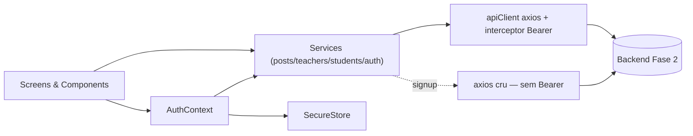

## Autenticação

A API da Fase 2 (branch `ajustes-fase-4`) utiliza **autenticação com `login` + senha (bcrypt)** e responde com **credencial separada do perfil**:

```
POST /auth/login { login, password }
   ↓
200 { user, profile, token }
   ↓
SecureStore.setItem (AUTH_TOKEN, AUTH_USER, AUTH_PROFILE)
   ↓
AuthContext atualiza estado → HeaderRight troca "Entrar" por "Sair" (+ "Painel" se TEACHER)
```

- **`user`** é a credencial: `{ id, login, role }`. Sem `name`, sem `email`.
- **`profile`** é `Teacher | Student | null` — onde estão os campos de exibição (`name`, `email`, `pronouns`, `disciplines`, `course`, etc.).
- **`token`** é o JWT (24h, sem refresh).

Na inicialização do app, o `AuthContext` faz **hydration** lendo as 3 chaves do SecureStore. Logout limpa as 3 chaves.

Em uma 401 de **request autenticada** (token expirado, sessão invalidada server-side, credencial removida), o response interceptor do Axios sinaliza o `AuthContext`, que limpa a sessão local **sem rede** (apaga `AUTH_TOKEN`/`AUTH_USER`/`AUTH_PROFILE` do SecureStore, zera `user`/`profile`) e exibe um Toast "Sessão expirada". Não há navegação forçada: as telas protegidas voltam ao fluxo público (Home) pelos guards de papel (`useRequireRole`). A detecção exige que a request tenha enviado `Authorization: Bearer` — por isso uma 401 **anônima** (ex.: `POST /comments` sem login) **não** desloga ninguém: ela continua exibindo o CTA "Faça login".

### Matriz de RBAC por ação

| Ação | Anônimo | STUDENT | TEACHER |
|------|:-------:|:-------:|:-------:|
| Ver lista de posts (só PUBLISHED) | ✅ | ✅ | ✅ (+DRAFT, +ARCHIVED) |
| Buscar / filtrar por disciplina | ✅ | ✅ | ✅ |
| Ler post (só PUBLISHED) | ✅ | ✅ | ✅ (qualquer status) |
| Ver lista de comentários | ✅ | ✅ | ✅ |
| **Criar comentário** | ❌ (backend retorna 401; CTA "Faça login") | ✅ | ✅ |
| Excluir próprio comentário | ❌ | ✅ | ✅ |
| Excluir qualquer comentário | ❌ | ❌ | ✅ |
| **Marcar post como lido** | ❌ (botão não renderiza) | ✅ | ✅ |
| Acessar painel admin | ❌ | ❌ | ✅ |
| **Criar post** (`POST /posts`) | ❌ | ❌ | ✅ |
| **Editar post** (`PATCH /posts/:id`) | ❌ | ❌ | ✅ |
| **Excluir post** (`DELETE /posts/:id`) | ❌ | ❌ | ✅ |
| **Listar todos os posts (admin)** (`GET /posts/search`) | ❌ | ❌ | ✅ (vê todos os status) |
| **CRUD /teachers** (`GET/POST/PATCH/DELETE`) | ❌ | ❌ | ✅ |
| **CRUD /students** (`GET/PATCH/DELETE`) | ❌ | ❌ | ✅ |
| **`POST /students` (auto-cadastro)** | ✅ (sem Bearer) | ❌ (403) | ❌ |
| **`PATCH /students/:id` próprio** | ❌ | ✅ (próprio) | ✅ |
| **`PATCH /teachers/:id` próprio** | ❌ | — | ✅ (próprio ou outro) |
| Ver página do grupo | ✅ | ✅ | ✅ |

### Troca de senha

`PATCH /auth/password` aceita `{ current_password, new_password }`, exposto pelo método `changePassword` do `auth.service`. O form em [src/screens/ChangePasswordScreen.tsx](src/screens/ChangePasswordScreen.tsx) tem três campos: senha atual + nova + confirmação. A validação Zod ([src/features/profile/validators/change-password.schema.ts](src/features/profile/validators/change-password.schema.ts)) usa dois `.refine` cruzados, cada um com `path` explícito para ancorar a mensagem no campo certo:

- `new_password === new_password_confirm` → mensagem `"As senhas não conferem."` em `path: ['new_password_confirm']` (campo de confirmação).
- `current_password !== new_password` → mensagem `"A nova senha deve ser diferente da atual."` em `path: ['new_password']` (campo da nova senha).

Cada campo tem toggle individual de visibilidade (`Input.trailingIcon="eye-outline" / "eye-off-outline"` com estado `showCurrent` / `showNew` / `showConfirm`). Em erro 400 (senha atual incorreta), o backend retorna `{ error: "Senha atual incorreta." }` e o app exibe a mensagem abaixo dos campos (`testID="submit-error"`).

## Fluxos por requisito

### Req 1 — Lista de posts com busca e filtro

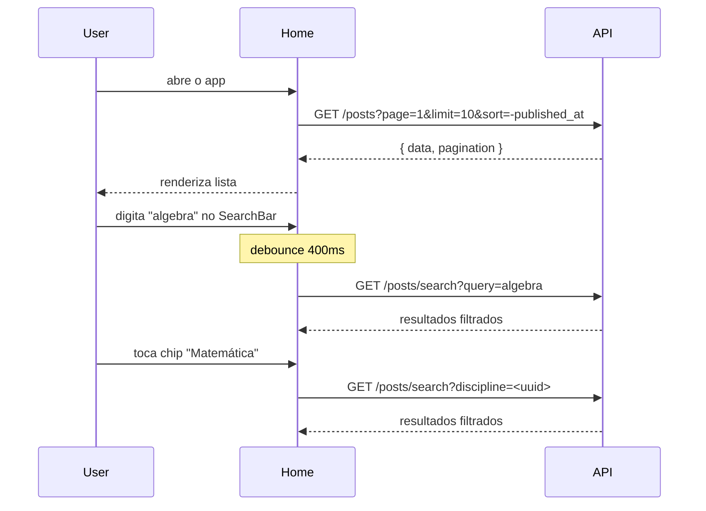

### Req 2 — Leitura de post + comentários + marcar como lido

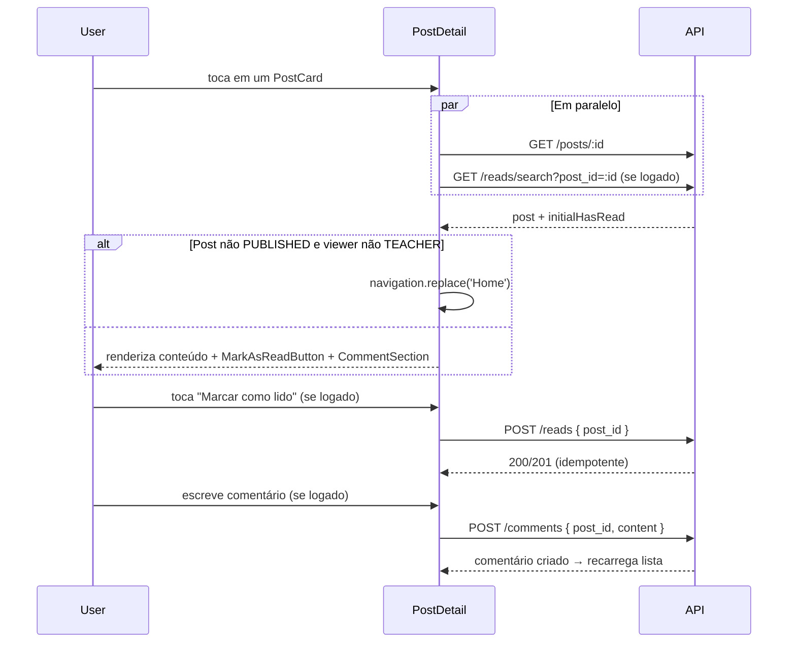

### Req 3 — Criar post (TEACHER)

```mermaid
sequenceDiagram
    participant T as TEACHER
    participant Admin as AdminPosts
    participant Create as PostCreate
    participant API

    T->>Admin: toca "Painel" no header
    Admin->>T: renderiza lista admin + stats
    T->>Admin: toca "+ Novo post"
    Admin->>Create: navigate('PostCreate')
    Create->>Create: useRequireRole('TEACHER') ok
    T->>Create: preenche form e submete
    Create->>API: POST /posts { title, content, status, discipline_id? }
    alt 201 Created
        API-->>Create: Post criado
        Create->>Create: toast "Post criado"
        Create->>T: navigate('PostDetail', { postId, title })
    else 401
        API-->>Create: Sessão expirada
        Create->>Create: logout() + replace('Login')
    else 403
        API-->>Create: Acesso negado
        Create->>Create: replace('Home') + toast
    end
```

### Req 4 — Editar post (TEACHER)

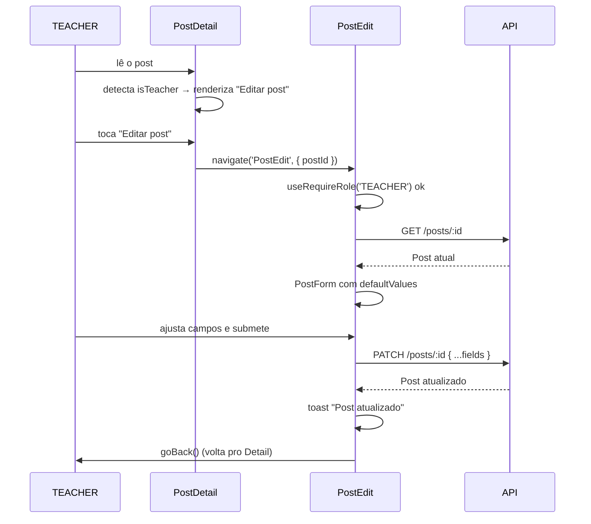

### Req 5/6 — Gerenciamento de professores e alunos (TEACHER)

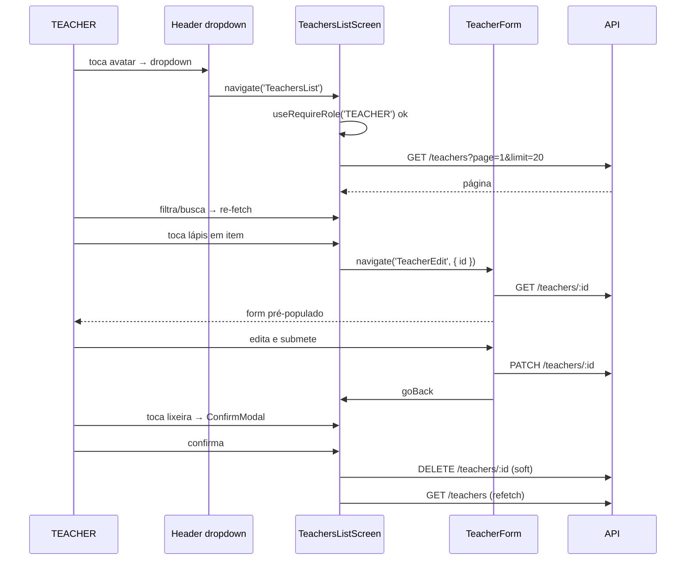

### Req 7 — Criação admin de aluno (TEACHER)

Pattern idêntico a Req 5/6 com `StudentsList`/`StudentCreate`/`StudentEdit`. `course` (texto livre) substitui `discipline_ids`.

### Req 8 — Auto-cadastro de aluno (público)

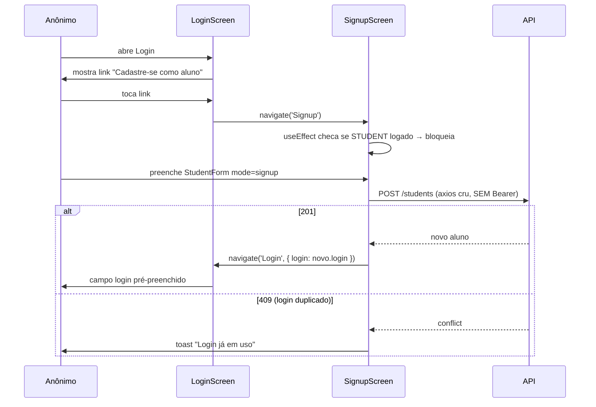

### Req 9 — Painel administrativo de posts (TEACHER)

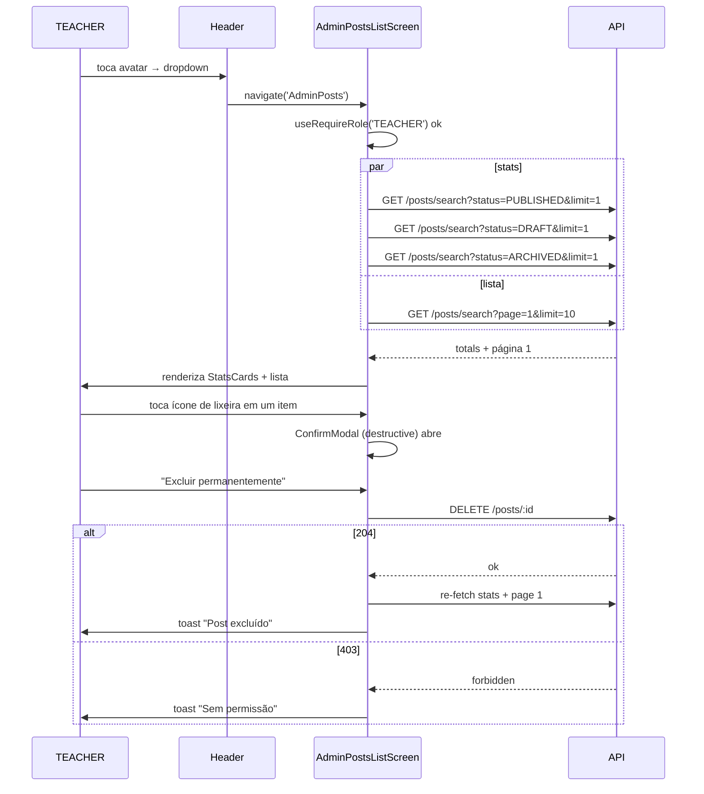

## Decisões arquiteturais (ADRs)

Algumas escolhas divergem do conteúdo padrão das aulas — registradas aqui para transparência.

| ADR | Decisão | Motivo |
|-----|---------|--------|
| 01 | **Expo SDK 56 (managed workflow)** em vez de React Native CLI | DX mais rápido, OTA via EAS, builds sem Xcode/Android Studio nativos para a maior parte do ciclo. |
| 02 | **NativeWind v4** em vez de `StyleSheet.create` ensinado em aula | Continuidade visual com a Fase 3 (Tailwind) e produtividade. |
| 03 | **react-hook-form + Zod** em vez de inputs controlados manuais | Mesmo pattern adotado na Fase 3; menos re-renders e inferência TS automática. |
| 04 | **Context API (`AuthContext`)** em vez de Redux Toolkit (aula RN Medium 6) | Um único reducer (auth) não justifica boilerplate de Redux. Spec da Fase 4 permite Context. |
| 05 | **expo-secure-store** para o JWT, em vez de AsyncStorage | SecureStore criptografa nativamente (Keychain no iOS, Keystore no Android). |
| 06 | **Native Stack dentro de um Drawer, com entrada pública** (não login wall) | Espelha o modelo da Fase 3 web (lista de posts é pública; login é opcional). O Drawer é navegação/descoberta; o controle de acesso permanece **por tela** — rotas TEACHER-only e autenticadas fazem auto-gate via `useRequireRole` (`useEffect` + `navigation.replace`). |
| 07 | **`comments_count`/`reads_count` no shape de Post** (não chamadas extras) | Backend já retorna esses contadores em toda resposta de Post. PostCard e PostDetail usam sem chamada adicional. |
| 08 | **Disciplines com fallback hardcoded para anônimos** | `GET /disciplines` exige Bearer; o filtro de disciplina precisa funcionar para visitantes. Solução: array `SEED_DISCIPLINES` com UUIDs estáveis do seed da Fase 2. |
| 09 | **Comentário criação só autenticada** (regra do backend) | A Fase 2 removeu o fluxo anônimo de comentários: `POST /comments` agora exige Bearer (401 sem token). Mobile mostra CTA "Faça login para comentar" para anônimos. |
| 10 | **`useRequireRole` hook** em vez de lógica inline por tela | Mesmo gate é reusado em AdminPosts, PostCreate, PostEdit e nas telas de CRUD de professores/alunos. Centralizar evita drift de comportamento entre telas. |
| 11 | **Sem ownership check no client** (qualquer TEACHER pode editar qualquer post) | Espelhamento exato do backend (Fase 2 §2.1). Botão "Editar post" renderiza pra qualquer TEACHER, independente de quem é o autor. |
| 12 | **Credencial separada do perfil (`User` ≠ `Profile`)** | Espelhamento do backend Fase 2 (branch `ajustes-fase-4`). Mobile guarda 3 chaves SecureStore (`AUTH_TOKEN`, `AUTH_USER`, `AUTH_PROFILE`). `AuthContext` expõe ambos; UI usa `user.role` para gating e `profile.name` para exibição. |
| 13 | **Referências FHIR (`Teacher/<uuid>`, `Student/<uuid>`)** | IDs de perfil incluem o tipo no formato FHIR. Concatenar direto nas URLs (`/teachers/${teacher.id}`) — backend resolve. **Não** usar `encodeURIComponent` no id inteiro (quebraria a barra). |
| 14 | **Display de autor com pronouns** | `Post.author` carrega `pronouns` do perfil do TEACHER. Exibimos como `Nome (pronome)` no PostDetail quando presente, omitimos quando `null`. |
| 15 | **`CommentAuthor.type` para distinguir Teacher/Student** | Backend entrega `type` resolvido. Exibimos "Professor" / "Aluno" no `CommentItem` em vez de parsear o prefixo do FhirRef. |
| 16 | **Inter (6 pesos) + JetBrains Mono via `@expo-google-fonts`** + SplashScreen gate | Paridade visual direta com a Fase 3 web. Inter 900 é necessário para títulos editoriais do PostDetail; JetBrains Mono é o sistema de metadata (timestamps, contadores, IDs) que o web usa sistematicamente. SplashScreen gate evita FOUT (flash of unstyled text). |
| 17 | **`@expo/vector-icons / MaterialCommunityIcons`** em vez de Material Symbols (que o web usa) | Material Symbols não é fonte instalável em RN sem hacks. MaterialCommunityIcons (6k+ ícones) já vem com Expo SDK 56, tem cobertura comparável e visual Material Design. Wrapper `<Icon>` com enum `IconName` força mapeamento tipado e centraliza os ≈25 ícones usados no app — typos pegam em compile time. |
| 18 | **`expo-linear-gradient`** para CTAs (`Button primary` e `Button nav`) | Espelhamento dos `cta-gradient` (teal) e `primary-gradient` (navy) do web. NativeWind não suporta gradientes nativamente; expo-linear-gradient é a API canônica do Expo e tem custo de bundle desprezível (~30KB). |
| 19 | **Comment avatar usa ícone `account`**, NÃO iniciais — divergência intencional do PostCard's AuthorId | Espelhamento exato do web (CommentItem.tsx usa Material Symbol `person`, não iniciais; PostCard.tsx usa iniciais). A diferença semântica: no PostCard, o autor é a identidade editorial (nome + iniciais reforçam isso); no comentário, o autor é um ator transitivo dentro de uma discussão (ícone neutro pesa menos). |
| 20 | **Stats via 3 chamadas paralelas a `searchPosts(status=X, limit=1)`** em vez de um endpoint de estatísticas dedicado | Backend não expõe `/posts/stats`. As 3 chamadas com `limit=1` lêem só `pagination.total`, o que é barato (apenas COUNT(*) no SQL). Falha silenciosa nas stats não bloqueia a lista — degradação aceita. |
| 21 | **`signupStudent` usa `axios` cru em vez do `apiClient` interceptado** | O interceptor de request do `apiClient` injeta `Authorization: Bearer <token>` quando há sessão. O endpoint `POST /students` é público e o backend retorna 403 quando recebe um Bearer de STUDENT logado (regra de produto: STUDENT não pode "se recadastrar"). Usar `axios.post(\`${API_BASE_URL}/students\`, ...)` direto evita o header e mantém o endpoint genuinamente público. |
| 22 | **`refreshProfile()` na AuthContext em vez de refetch nas telas** | A Header dropdown depende de `profile.name` para mostrar o nome do usuário. Sem `refreshProfile`, depois de editar o perfil o usuário só veria o novo nome após próximo login. Centralizar na AuthContext garante consistência entre todas as telas que leiam `profile`. |
| 23 | **Cross-field refines no `changePasswordSchema`** com path explícito | Zod `.refine()` permite associar a mensagem a um campo específico via `path: ['new_password_confirm']` / `['new_password']` — isso faz o RHF exibir o erro embaixo do campo certo, não no objeto root. Sem `path`, o RHF entrega `errors.root` e o usuário não sabe qual campo arrumar. |
| 24 | **`useFocusEffect` na ProfileScreen** em vez de `useEffect` | Quando o usuário volta da ProfileEditScreen via `goBack`, `useEffect` não dispara (o componente não desmontou). `useFocusEffect` do React Navigation re-roda quando a tela ganha foco, garantindo o refetch dos dados recém-editados. |
| 25 | **Drawer (menu lateral) como navegação primária**, em vez de Bottom Tabs | Espelha a **sidebar** da Fase 3 web (navegação + disciplinas + administração numa coluna lateral), não uma tab bar. O Drawer acomoda melhor a seção **Disciplinas** — de tamanho variável, carregada dinamicamente via `listDisciplines()` e usada como eixo de descoberta/filtro — e a seção **Administração** que só aparece para TEACHER; uma tab bar (3–5 abas fixas) não comporta esse número variável de destinos. Implementado como `@react-navigation/drawer` (v7) envolvendo o Native Stack numa única `Screen` (`Root`); `@react-navigation/bottom-tabs` foi removido. O Drawer é só navegação — o gate de acesso permanece no `useRequireRole` (ADR 06/10). |
| 26 | **Markdown no mobile: leitura com o fork mantido `@ronradtke/react-native-markdown-display`, edição com `TextInput` + abas Escrever/Prévia, sem toolbar** | O `content` do post é Markdown puro guardado como texto pelo backend (Fase 2 não processa/sanitiza; o cliente renderiza). O guia mobile da Fase 2 recomenda `react-native-markdown-display`, mas o pacote nominal (v7.0.2/2023) está desatualizado para a stack nova (React 19 / RN 0.85); usamos o fork mantido `@ronradtke` (v9.0.3/2026), que é drop-in (mesma API). Leitura e prévia do editor reusam um único componente `MarkdownContent`, estilizado via `StyleSheet` mapeado aos tokens do Design System (`colors.ts`) — a única exceção a `className`/NativeWind no app, pois a API da lib exige um objeto de estilo por elemento. Edição usa `TextInput` multiline com abas **Escrever/Prévia**, sem toolbar de formatação: no mobile, inserir sintaxe manipulando seleção/cursor do `TextInput` é frágil e caro em testes, com pouco retorno; as abas entregam o benefício central (ver o resultado) reusando a mesma peça de render. Segurança: o renderer não interpreta HTML cru por padrão (equivalente ao `skipHtml` da web). Diverge do editor rico da Fase 3 web (`@uiw/react-md-editor`, com toolbar) e da lib nominal da Fase 2. |

## Design System

### Tipografia

Inter (sans) + JetBrains Mono (monospace para metadata) via [`@expo-google-fonts`](https://github.com/expo/google-fonts), carregadas no boot (SplashScreen gate em `App.tsx`).

| Classe Tailwind | Family | Peso |
|-----------------|--------|------|
| `font-sans` | Inter | 400 |
| `font-sans-medium` | Inter | 500 |
| `font-sans-semibold` | Inter | 600 |
| `font-sans-bold` | Inter | 700 |
| `font-sans-extrabold` | Inter | 800 |
| `font-sans-black` | Inter | 900 |
| `font-jetbrains` | JetBrains Mono | 400 |

Inter Black (900) é usado em títulos editoriais (PostDetail, headlines); ExtraBold (800) em títulos de PostCard; JetBrains Mono em **toda metadata** (timestamps, contadores, IDs).

### Iconografia

[`@expo/vector-icons` / `MaterialCommunityIcons`](https://icons.expo.fyi/Index) — wrapper em [src/components/ui/Icon.tsx](src/components/ui/Icon.tsx) restringe nomes a uma enum tipada (`IconName`).

**Mapeamento aproximado Material Symbols (web) → MaterialCommunityIcons (mobile):** aproximação visual, não 1:1 — ver ADR 17.

### Paleta M3 (alinhada à Fase 3 web)

Tokens centralizados em [src/theme/colors.ts](src/theme/colors.ts) (espelham os tokens M3 da Fase 3 web). Principais:

| Token | Hex | Uso |
|-------|-----|-----|
| `background` / `surface` | `#F9F9FF` | Fundo base das telas |
| `surfaceContainerLowest` | `#FFFFFF` | Camada mais clara (cards, modais) |
| `surfaceContainerLow` | `#F0F3FF` | Separação tonal de seções |
| `surfaceContainer` / `card` | `#E7EEFF` | Container de cards (alias `card` legado) |
| `foreground` | `#111C2D` | Texto principal |
| `muted` | `#43474E` | Texto secundário / metadata |
| `primary` | `#022448` | Cor de marca (navy); base do `primary-gradient` |
| `primaryForeground` | `#FFFFFF` | Texto sobre `primary` |
| `secondary` | `#006A61` | Teal; base do `cta-gradient` dos CTAs |
| `outline` | `#74777F` | Bordas/ícones de contorno |
| `outlineVariant` / `border` | `#C4C6CF` | Ghost borders (hairline + opacidade) |
| `success` | `#16A34A` | Confirmações fora de status de post |
| `warning` | `#D97706` | Avisos |
| `error` | `#BA1A1A` | Texto/estado de erro |
| `errorContainer` | `#FFDAD6` | Background de input com erro |

**Status colors** (divergem dos M3 success/warning/neutral — são específicos do DS web):
| Token | Hex | Uso |
|-------|-----|-----|
| `status-published` | `#22C55E` | PUBLISHED badge + dot |
| `status-draft` | `#EAB308` | DRAFT badge + dot |
| `status-archived` | `#94A3B8` | ARCHIVED badge + dot |

**Paleta `AuthorAvatar`:** 6 cores pastel (bg / border / text) — escolha determinística por hash do nome. Fallback slate para nomes nulos.

| Token | bg | border | text |
|-------|-----|--------|------|
| `avatarBlue` | `#DBEAFE` | `#BFDBFE` | `#1D4ED8` |
| `avatarEmerald` | `#D1FAE5` | `#A7F3D0` | `#047857` |
| `avatarTeal` | `#CCFBF1` | `#99F6E4` | `#0F766E` |
| `avatarAmber` | `#FEF3C7` | `#FDE68A` | `#B45309` |
| `avatarRose` | `#FFE4E6` | `#FECDD3` | `#BE123C` |
| `avatarViolet` | `#EDE9FE` | `#DDD6FE` | `#6D28D9` |
| `avatarSlate` (fallback) | `#F1F5F9` | `#E2E8F0` | `#475569` |

### Disciplinas — referência única

Mapping `label → { icon, color }` em [src/lib/disciplines.ts](src/lib/disciplines.ts):

| Disciplina | Icon | Cor |
|-----------|------|-----|
| Matemática | `function-variant` | `#2563EB` (blue-600) |
| Português | `book-open-page-variant-outline` | `#D97706` (amber-600) |
| Ciências | `flask-outline` | `#059669` (emerald-600) |
| História | `book-clock` | `#E11D48` (rose-600) |
| Geografia | `earth` | `#0D9488` (teal-600) |

### Componentes (props notáveis)

| Componente | Props |
|-----------|-------|
| `Button` | `variant: 'primary' \| 'nav' \| 'secondary' \| 'danger' \| 'danger-outline'`, `size: 'sm' \| 'md' \| 'lg'`, `leadingIcon`, `trailingIcon`, `loading`. `primary`/`nav` usam `expo-linear-gradient` (cta-gradient teal e primary-gradient navy). |
| `Input` | `label`, `error`, `hint`, `leadingIcon`, `trailingIcon`, `onTrailingIconPress`. Erro **sem borda vermelha**, só background shift. |
| `Card` | `elevation: 'none' \| 'soft' \| 'editorial'` (default `editorial`). |
| `Spinner` | `size: 'sm' \| 'md'` (Animated.loop com rotate). |
| `Loader` | `message`, `fullScreen`. Usa Spinner internamente. |
| `EmptyState` | `title`, `subtitle`, `icon` (default `inbox-outline`, 64px), `action`. |
| `Skeleton` | `className` (Animated.pulse 0.4↔0.7). |
| `StatusBadge` | `status: 'PUBLISHED' \| 'DRAFT' \| 'ARCHIVED'`. Renderiza dot + label uppercase. |
| `DisciplineBadge` | `label`. Cor + label de `DISCIPLINE_META`. Fallback "Sem disciplina". |
| `AuthorAvatar` | `name`, `size: 'sm' \| 'md' \| 'lg'`, `variant: 'initials' \| 'icon'`. 6 cores pastel determinísticas. |
| `AuthorId` | `name`, `subtitle`, `date` (só `lg`), `size`, `avatarVariant`. Composite avatar + texto. |
| `IconCount` | `type: 'comment' \| 'bookmark' \| 'views'`, `count`, `size`. Ícone + número em JetBrains Mono. |
| `ConfirmModal` | `isOpen`, `title`, `description`, `confirmLabel`, `cancelLabel`, `variant: 'destructive' \| 'neutral'`, `onConfirm`, `onCancel`, `isLoading`. |
| `Badge` | `label`, `tone`. Pílula genérica usada como base de `StatusBadge` / `DisciplineBadge`. |
| `StatsCard` | `label`, `count`, `tone`, `icon`. Cartão de estatística do painel admin (PUBLISHED / DRAFT / ARCHIVED). |
| `PronounsPicker` | `value`, `onChange`. Seletor de pronomes do TeacherForm (perfil/edição). |
| `DisciplinesMultiSelect` | `value` (ids), `onChange`, `options`. Multi-seleção de disciplinas do TeacherForm. |
| `Icon` | `name: IconName`, `size`, `color`. Wrapper de MaterialCommunityIcons. |

### Regras visuais críticas (espelham o web)

1. **Botões primary usam gradient teal**, nunca `bg-primary` sólido.
2. **Inputs com erro NÃO têm borda vermelha** — só background `error-container/20` + texto de erro abaixo.
3. **"No 1px solid borders rule"** — separação de seções por tonal layering (`surface-container-low` vs `surface-container-lowest`). Quando 1px é necessário, usar hairlineWidth + `outline-variant/40` (ghost border).
4. **Cards usam `editorial-shadow`** (sombra navy 5% opacidade, blur 20px, offset 12px) — sem sombras pesadas.
5. **Metadata sempre em monospace** (`font-jetbrains`) — timestamps, contadores, IDs.
6. **Comment avatar usa ícone `account`**, NUNCA iniciais (divergência intencional do PostCard's AuthorId — espelha o web, ADR 19).

### Como adicionar um novo ícone

1. Conferir o nome em https://icons.expo.fyi/Index (`MaterialCommunityIcons`).
2. Adicionar ao tipo `IconName` em [src/components/ui/Icon.tsx](src/components/ui/Icon.tsx).
3. Usar: `<Icon name="novo-icone" size={20} color={colors.primary} />`.

## Testes

Suíte com **393 testes em 68 suites**, rodando em **Jest + @testing-library/react-native** (preset `jest-expo`). Todos passam (`Tests: 393 passed, 393 total`).

### Cobertura por camada

| Camada | Foco |
|--------|------|
| Schemas Zod | login, post, comment, teacher, student, change-password — validação completa de cada campo, refines cruzados e transformações (`trim`, `preprocess`). |
| Services | auth, posts, comments, reads, disciplines, teachers, students — mock do `apiClient`, URL + payload corretos, omissão de `undefined`, propagação de erro. |
| Componentes DS | Button, Input, Card, Badge, StatusBadge, DisciplineBadge, AuthorAvatar, AuthorId, IconCount, ConfirmModal, StatsCard, Spinner, EmptyState, Skeleton, Icon, PronounsPicker, DisciplinesMultiSelect — renderização, props críticos e interação. |
| Componentes de feature | PostCard, SearchBar, MarkAsReadButton, StatusPicker, CommentItem, CommentForm, AdminPostListItem — composição + estado interno. |
| Screens | Home, PostDetail, PostCreate, PostEdit, AdminPosts, Login, Signup, Grupo, TeachersList, TeacherCreate, TeacherEdit, StudentsList, StudentCreate, StudentEdit, Profile, ProfileEdit, ChangePassword — role gate, fetch + estado, submit e navegação. |
| Layout | Header — dropdown autenticado, itens por role. |
| Contexts | AuthContext — hydration, login, logout, `refreshProfile`. |

### Comandos

| Comando | Descrição |
|---------|-----------|
| `npm test` | Roda a suíte completa (execução única). |
| `npm test -- <pattern>` | Filtra por nome de arquivo/teste (ex: `npm test -- ChangePassword`). |
| `npm test -- --watch` | Modo watch (re-roda ao salvar). |

> **Pré-requisito de runner:** os testes exigem **Node ≥ 20** (Expo SDK 56). Rodar com Node 14/16 quebra o `jest-expo` antes de qualquer teste (ver Dificuldades #6).

## Roadmap concluído

- ✅ Fase 1 — Fundação + Login
- ✅ Fase 1.1 — Ajustes pós-revisão (tokens M3 + timeout)
- ✅ Fase 1.2 — Refactor de navegação (modelo público)
- ✅ Fase 1.3 — Refactor de auth (credencial + perfil + senha)
- ✅ Fase 2 — Posts: leitura (lista, busca, detalhe, comentários, reads)
- ✅ Fase 3 — Posts: escrita para professor (criar/editar)
- ✅ Fase 1.4 — Polimento visual do DS (paridade com Fase 3 web)
- ✅ Fase 4 — Posts: administração (lista admin + delete)
- ✅ Fase 5 — Usuários: CRUD de professores e alunos + auto-cadastro
- ✅ Fase 6 — Perfil + Trocar senha + Fechamento de docs

## Dificuldades Encontradas

### 1. Validação Zod aceitando campos só com espaços em branco (formulários de professor/aluno)

**Problema:** campos obrigatórios como `name`, `email` e `login` definidos como `z.string().min(1)` passavam na validação quando o usuário digitava apenas espaços. Uma string como `"   "` tem `length > 1`, então satisfaz `.min(1)` — mas semanticamente está vazia. O input nativo entrega exatamente esse conteúdo (whitespace), não `undefined`.

**Tentativas:** aumentar o `.min(1)` para `.min(2)` foi descartado (nomes válidos de 1 letra existem). Usar `.refine(v => v.trim().length > 0)` funcionou mas gerou mensagens de erro fora do padrão dos demais campos.

**Solução final:** encadear `.trim()` antes do `.min(1)` no próprio schema — `z.string().trim().min(1, 'Nome é obrigatório.')`. O `.trim()` normaliza o valor antes da checagem de tamanho, de forma que `"   "` vira `""` e falha o `.min(1)` corretamente. Para os blocos `user` opcionais (criação de credencial), usamos `z.preprocess` para normalizar/omitir o objeto inteiro quando vazio — caso diferente, que exige transformar o shape, não só aparar a string.

**Aprendizado:** para qualquer campo de texto obrigatório em RHF + Zod no React Native, `.trim().min(1)` é o padrão correto — o input entrega whitespace, e sem `.trim()` o `.min(1)` é facilmente burlado.

---

### 2. Conflito entre `jest-expo` e `@react-native/jest-preset` nos testes de Fase 5

**Problema:** ao rodar `npm test` após adicionar os specs das telas `TeachersListScreen` e `SignupScreen`, o Jest jogava `SyntaxError: Cannot use import statement in a module` para módulos internos do Expo (ex: `expo-secure-store`, `expo-linear-gradient`). A causa era que o `jest.config.js` herdado usava `preset: '@react-native/jest-preset'` diretamente, sem o wrapper `jest-expo` que já inclui as transformações necessárias para módulos nativos do Expo.

**Solução:** substituir o preset por `preset: 'jest-expo'` e mover as entradas de `transformIgnorePatterns` para a lista canônica recomendada pela documentação do Expo (`node_modules/(?!((jest-)?react-native|@react-native(-community)?)|expo(nent)?|@expo(nent)?/.*|...)`). Isso resolveu os erros de import sem afetar os testes das fases anteriores.

**Aprendizado:** projetos Expo devem sempre usar `jest-expo` como preset base — não combinar `@react-native/jest-preset` diretamente, mesmo que este seja o que os exemplos genéricos de React Native mostram.

---

### 3. Mock de `createInteropElement` necessário para NativeWind v4 nos testes

**Problema:** após resolver o preset, testes que renderizavam componentes estilizados com NativeWind falhavam com `TypeError: (0 , _reactNative.createElement) is not a function` ou `createInteropElement is not a function`. O NativeWind v4 substitui internamente o `createElement` por um wrapper (`createInteropElement`) que não é transpilado corretamente no ambiente de teste Jest (que não passa pelo Metro bundler).

**Solução:** adicionar em `jest.setup.js`:
```js
jest.mock('nativewind', () => ({
  ...jest.requireActual('nativewind'),
  styled: (Component) => Component,
}));
```
e mapear `nativewind/dist/style-sheet/native` para um stub vazio no `moduleNameMapper`. Componentes de teste passaram a usar `className` como prop simples sem processar o Tailwind.

**Aprendizado:** NativeWind v4 exige configuração extra de mock em Jest porque o seu babel plugin não é executado fora do Metro. O padrão é sempre ter um `__mocks__/nativewind.js` ou a entrada equivalente no `moduleNameMapper`.

---

### 4. Re-render infinito no `TeachersListScreen` causado por dependência de objeto em `useEffect`

**Problema:** a tela de listagem de professores entrava em loop de re-fetch logo após montar: o `useEffect` de busca declarava `[filters]` como dependência, mas `filters` era um objeto recriado a cada render pelo `useState` com valor inicial inline (`{ page: 1, limit: 20 }`). Como objetos são comparados por referência no JavaScript, o React detectava mudança a cada ciclo e re-disparava o efeito.

**Tentativas:** memoizar `filters` com `useMemo` resolveu o loop mas introduziu dependências circulares com o `setFilters` do state. Usar `useRef` para guardar o valor anterior foi descartado por aumentar a complexidade.

**Solução final:** separar os filtros em primitivos individuais (`page`, `query`, `limit`) no `useState`, e compor o objeto de query apenas dentro do `useEffect`, sem incluí-lo como dependência. Assim as dependências do efeito são apenas primitivos (`page`, `query`, `limit`), cuja comparação por valor é estável.

**Aprendizado:** nunca declarar objetos ou arrays como dependências de `useEffect` quando eles são recriados a cada render. Preferir primitivos como dependências e construir objetos compostos dentro do próprio efeito.

---

### 5. Endpoint `POST /students` retorna 403 para STUDENT logado (axios interceptor injetava Bearer)

**Problema:** ao testar o fluxo de auto-cadastro (`SignupScreen`) com um STUDENT já logado na sessão (cenário de regressão), a chamada `POST /students` retornava 403. O interceptor de request do `apiClient` injeta `Authorization: Bearer <token>` automaticamente sempre que há sessão no `AuthContext`. O backend Fase 2 interpreta o Bearer de um STUDENT como uma tentativa de "se recadastrar" e nega com 403 por regra de negócio.

**Solução:** usar `axios.post(\`${API_BASE_URL}/students\`, payload)` diretamente (sem o `apiClient`), de forma que nenhum header de autorização seja anexado. A `SignupScreen` também bloqueia STUDENTs já logados via `useEffect` (redireciona para Home), mas o uso de axios cru garante que a chamada seja genuinamente pública independentemente do estado da sessão. Registrado como ADR 21.

**Aprendizado:** interceptors de request são convenientes, mas têm efeito colateral em endpoints públicos que são sensíveis à presença do Bearer. Nesses casos, usar a instância base do axios (sem interceptor) é mais correto do que tentar remover o header dentro do interceptor por rota.

---

### 6. Node 14 vs Expo SDK 56 no runner de testes

**Problema:** rodar `npm test` com o Node default da máquina (v14.19.0) quebrava o `jest-expo` com `SyntaxError: Unexpected token '??='` (operador de logical-assignment) vindo do *winter runtime* do Expo — o erro acontecia **antes** de qualquer teste rodar, na fase de setup do preset.

**Causa:** o Expo SDK 56 exige Node ≥ 20. O runtime do Expo usa sintaxe de logical-assignment (`??=`, `||=`) que só é suportada a partir do Node 15, então o Node 14 falha ao parsear o próprio preset.

**Solução:** padronizar o uso do **Node 20.19.4** (versão que o Expo 56 mira), instalado via `nvm`, para todos os comandos `node`/`npm`/`npx`. A linha de **Pré-requisitos** foi atualizada para deixar explícito **Node ≥ 20**, e a seção de Testes registra o mesmo requisito.

**Aprendizado:** a versão do Node não é só uma recomendação no Expo SDK 56 — é um pré-requisito rígido do tooling. Fixar a versão via `nvm` evita falhas que não têm relação com o código de teste em si.

---

### 7. Tornar `refreshProfile` obrigatório na interface `AuthContextValue` quebrou ~15 arquivos de teste

**Problema:** depois de adicionar `refreshProfile` como propriedade **obrigatória** de `AuthContextValue` (necessário para o padrão da ADR 22), o `tsc` passou a acusar `Property 'refreshProfile' is missing in type ...` em todos os mocks inline do contexto espalhados pelos testes (Header, várias screens, etc.).

**Causa:** o TypeScript em modo strict exige que **todo** consumidor/produtor do tipo seja atualizado. Cada teste que montava um literal de `AuthContextValue` à mão tornou-se inválido ao adicionar o novo membro obrigatório.

**Solução:** adicionar `refreshProfile: jest.fn()` a cada literal de mock do contexto nos ~15 arquivos afetados.

**Aprendizado:** estender um tipo de contexto amplamente consumido é uma mudança transversal — o custo não está em implementar a função, e sim em propagar o novo membro por todos os mocks. Vale considerar um helper `makeAuthValue(overrides)` para centralizar a forma do mock e evitar essa cascata no futuro.

---

### 8. `useFocusEffect` (re-fetch ao focar) causando loop de render no teste da ProfileScreen

**Contexto:** a `ProfileScreen` usa `useFocusEffect` para re-buscar os dados sempre que a tela ganha foco — assim, ao voltar da edição (`goBack`), ela mostra os dados atualizados (ADR 24).

**Problema:** o mock ingênuo `useFocusEffect: (cb) => cb()` disparava o callback **durante** o render. Como o callback chama `setState`, isso re-renderizava o componente, que chamava o `cb` de novo → `Error: Too many re-renders`.

**Causa:** o `useFocusEffect` real roda o callback **depois** do render (dentro de um efeito), não durante. O mock síncrono violava essa garantia e criava o loop.

**Solução:** o mock passou a rodar o callback uma única vez **após a montagem**, via `useEffect`. O componente de produção permaneceu fiel ao comportamento real (re-fetch ao focar). (Relacionado à Dificuldade #4, sobre dependência de objeto em `useEffect`.)

**Aprendizado:** ao mockar hooks de ciclo de vida (`useFocusEffect`, `useEffect`), o mock precisa respeitar **quando** o callback roda, não só **se** ele roda. Disparar um efeito durante o render é o caminho mais rápido para um loop infinito.

---

### 9. Refines cruzados do Zod precisam de `path` explícito para ancorar a mensagem no campo certo

**Contexto:** o `changePasswordSchema` valida que a confirmação bate com a nova senha e que a nova senha é diferente da atual — duas regras que envolvem mais de um campo (cross-field).

**Problema:** sem `path`, um `.refine()` do Zod associa a mensagem ao objeto raiz; o `react-hook-form` então entrega o erro em `errors.root`, e o usuário não vê **embaixo de qual campo** está o problema.

**Causa:** `.refine()` por padrão não sabe a qual campo a falha pertence — para regras de objeto, o erro nasce no nível do objeto.

**Solução:** declarar `path: ['new_password_confirm']` no refine de confirmação e `path: ['new_password']` no refine de "senha diferente da atual". Assim o RHF expõe `errors.new_password_confirm` / `errors.new_password` e a mensagem aparece ancorada no `Input` correto. Registrado como ADR 23.

**Aprendizado:** todo refine cruzado em RHF + Zod deve declarar `path` apontando para o campo onde o usuário precisa agir; do contrário a UX de validação fica "cega".

---

### 10. Ponte entre o singleton do Axios e o React Context para tratar 401 global

**Contexto:** o `apiClient` é um singleton de módulo criado no import, mas o estado de sessão vive no `AuthContext` (React state). Para deslogar automaticamente numa 401 de sessão expirada, o response interceptor (módulo) precisava acionar o `AuthContext` (React).

**Problema:** o interceptor não pode importar o Context — não há instância React no escopo do módulo, e o import criaria acoplamento/ciclo (Context → api → Context). Antes desta correção o comportamento de auto-logout nem existia: cada tela autenticada tratava 401 de forma ad-hoc (`logout()` + `replace('Login')`), e o README afirmava um tratamento global que não estava no código.

**Solução:** **registro de callback**. A camada de api expõe `setUnauthorizedHandler(fn)`; o `AuthProvider` registra o handler num `useEffect` (e o limpa no cleanup); o interceptor chama esse handler numa 401 qualificada e **sempre** re-rejeita o erro (os catches dos services/telas seguem funcionando). O handler limpa a sessão **localmente** (`clearSession()` — sem `POST /auth/logout`, que só geraria outra 401) e zera o estado; sem navegação, as telas protegidas caem para Home pelos guards (`useRequireRole`). Os 10 handlers 401 ad-hoc das telas foram removidos para o handler global virar fonte única.

**Cuidado central:** **não deslogar 401 anônima.** O gatilho checa `error.config.headers.Authorization` — só dispara quando a request realmente carregava um Bearer. Assim, `POST /comments` de visitante (401 proposital, ADR 09) e o próprio login (que não envia Bearer) não derrubam sessão nenhuma. Detalhe descoberto na implementação: o `POST /auth/login` com credencial inválida retorna **401**, não 400/404 — mas como a request de login não carrega Bearer, o handler corretamente a ignora; a robustez vem de checar o header, não o status.

**Aprendizado:** para conectar um singleton de módulo a estado de React sem acoplamento, exponha um setter de callback registrado via `useEffect` em vez de importar o Context. E ao centralizar tratamento de erro num interceptor, distinga a 401 "de sessão" (request autenticada) da 401 "de autorização anônima" pela presença do token enviado — não pelo status code.

---

### 11. Títulos do Markdown renderizavam sem negrito (peso normal)

**Problema:** ao renderizar Markdown no `MarkdownContent` (leitura do post e prévia do editor), os headings (`h1`-`h6`) apareciam com o mesmo peso visual do corpo do texto — sem negrito —, apesar do estilo de cada heading definir `fontWeight: '700'`/`'800'`.

**Causa:** o renderer da lib de Markdown propaga o `fontFamily` do estilo `body` (`Inter_400Regular`) para os elementos filhos, incluindo os headings. As fontes carregadas via `@expo-google-fonts/inter` são de **peso fixo** — cada peso é uma família separada (`Inter_400Regular`, `Inter_700Bold`, `Inter_800ExtraBold` etc.), não uma família variável com múltiplos pesos. Nesse cenário, `fontWeight` isolado é um no-op no React Native: a fonte efetivamente carregada (`Inter_400Regular`) não tem uma variante 700/800 para o motor de texto escolher.

**Solução:** trocar `fontWeight` por `fontFamily` explícito nos estilos dos headings — `Inter_800ExtraBold` para `heading1`/`heading2`, `Inter_700Bold` para `heading3`-`heading6` — seguindo a mesma convenção já usada no resto do app, que usa classes NativeWind como `font-sans-bold`/`font-sans-extrabold` e nunca a prop `fontWeight` isolada, justamente por essa limitação de fontes de peso fixo.

**Aprendizado:** com fontes de peso fixo (cada peso = uma família distinta), `fontWeight` sozinho não produz negrito no React Native — é preciso apontar a família correta via `fontFamily`. Vale como regra geral para qualquer estilo do app que precise de peso de fonte, dentro ou fora do NativeWind.

---

## Equipe

Grupo 6 — turma 8FSDT (FIAP).

Projeto desenvolvido pelo Grupo 6 ao longo das 6 fases: fundação e login, refactors de navegação e autenticação, leitura e escrita de posts, painel administrativo, CRUD de usuários e auto-cadastro, e o fechamento com perfil próprio + troca de senha + documentação.
